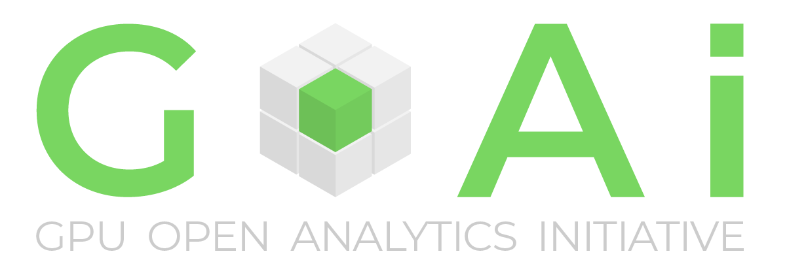
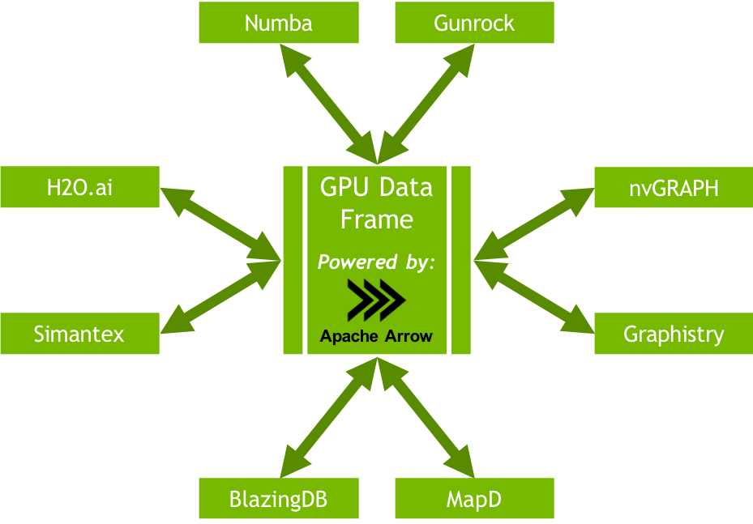

# PyGDF

[](http://pygdf.readthedocs.io/en/latest/?badge=latest)

PyGDF implements the Python interface to access and manipulate the GPU DataFrame of [GPU Open Analytics Initiative (GoAi)](http://gpuopenanalytics.com/).  We aim to provide a simple interface that is similar to the Pandas DataFrame and hide the details of GPU programming. 

[Read more about GoAi and the GDF](#gpu-open-analytics-initiative)

## Setup

### Conda

You can get a minimal conda installation with [Miniconda](https://conda.io/miniconda.html) or get the full installation with [Anaconda](https://www.anaconda.com/download).

You can install and update PyGDF using the conda command:

```bash
conda install -c numba -c conda-forge -c gpuopenanalytics/label/dev -c defaults pygdf=0.1.0a2
```

You can create and activate a development environment using the conda command:

```bash
conda env create --name pygdf_dev --file conda_environments/testing_py35.yml
source activate pygdf_dev
```

### Install from Source

To install PyGDF from source, clone the repository and run the python install command:

```bash
git clone https://github.com/gpuopenanalytics/pygdf.git
python setup.py install
```

Note: This assumes dependencies including (libgdf)[https://github.com/gpuopenanalytics/libgdf] are already installed, so it is recommended to use the conda environment.

There is also a Dockerfile which builds and installs LibGDF and PyGDF from source:
```
# From pygdf project root, with CUDA 9.2 driver installed on host machine:
docker build -t pygdf .
...
 ---> ec65aaa3d4b1
 Successfully built ec65aaa3d4b1
 Successfully tagged pygdf:latest

# Make sure nvidia-docker2 is installed: https://github.com/nvidia/nvidia-docker/wiki/Installation-(version-2.0)
docker run --runtime=nvidia -it pygdf bash
~/pygdf$ docker run --runtime=nvidia -it pygdf bash
/# source activate gdf
(gdf) root@3f689ba9c842:/# python -c "import pygdf"
(gdf) root@3f689ba9c842:/# 
```

### Pip

Currently, we don't support pip install yet.  Please use conda for the time being.

### Testing

This project uses [py.test](https://docs.pytest.org/en/latest/).

In the source root directory and with the development environment activated, run:

```bash
py.test
```

## Getting Started

Please see the [Demo Docker Repository](https://github.com/gpuopenanalytics/demo-docker) for example notebooks on how you can utilize the GPU DataFrame.

## GPU Open Analytics Initiative

The GPU Open Analytics Initiative (GoAi) seeks to foster and develop open collaboration between GPU analytics projects and products to enable data scientists to efficiently combine the best tools for their workflows. The first project of GoAi is the GPU DataFrame (GDF), which enables tabular data to be directly exchanged between libraries and applications on the GPU.

<div align="center"></div>

### GPU DataFrame

The GPU DataFrame is a common API that enables efficient interchange of tabular data between processes running on the GPU. End-to-end computation on the GPU avoids unnecessary copying and converting of data off the GPU, reducing compute time and cost for high-performance analytics common in artificial intelligence workloads. The GPU DataFrame uses the [Apache Arrow](https://arrow.apache.org/) columnar data format on the GPU. Currently, a subset of the features in Arrow are supported.

<div align="center"></div>
