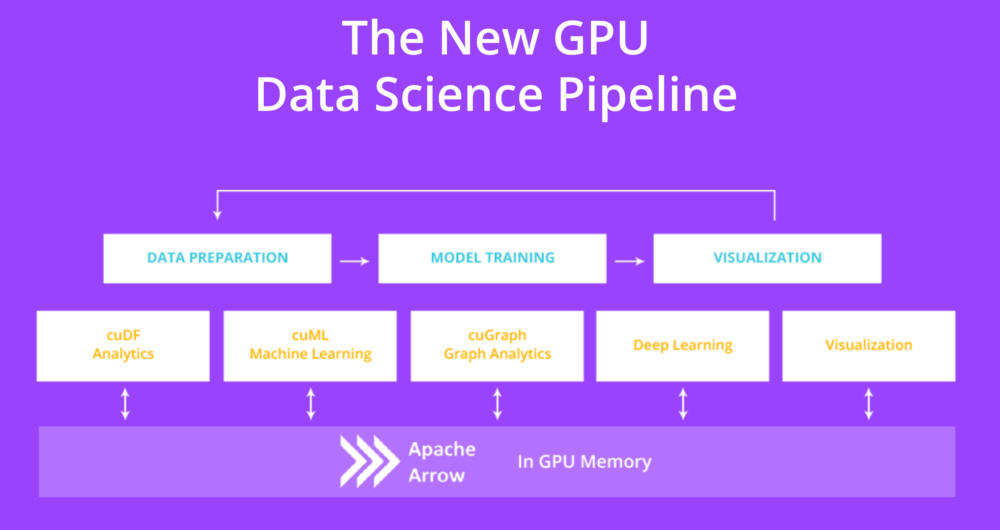

# <div align="left">&nbsp;cuDF - GPU DataFrames</div>

[](http://18.191.94.64/job/cudf-master/)&nbsp;&nbsp;[](https://rapidsai.github.io/projects/cudf/en/latest)

**NOTE:** For the latest stable [README.md](https://github.com/rapidsai/cudf/blob/master/README.md) ensure you are on the `master` branch.

Built based on the [Apache Arrow](http://arrow.apache.org/) columnar memory format, cuDF is a GPU DataFrame library for loading, joining, aggregating, filtering, and otherwise manipulating data.

cuDF provides a pandas-like API that will be familiar to data engineers & data scientists, so they can use it to easily accelerate their workflows without going into the details of CUDA programming.

For example, the following snippet downloads a CSV, then uses the GPU to parse it into rows and columns and run calculations:
```python
import cudf, io, requests
from io import StringIO

url="https://github.com/plotly/datasets/raw/master/tips.csv"
content = requests.get(url).content.decode('utf-8')

tips_df = cudf.read_csv(StringIO(content))
tips_df['tip_percentage'] = tips_df['tip']/tips_df['total_bill']*100

# display average tip by dining party size
print(tips_df.groupby('size').tip_percentage.mean())
```

Output:
```
size
1    21.729201548727808
2    16.571919173482897
3    15.215685473711837
4    14.594900639351332
5    14.149548965142023
6    15.622920072028379
Name: tip_percentage, dtype: float64
```

For additional examples, browse our complete [API documentation](https://rapidsai.github.io/projects/cudf/en/latest/index.html), or check out our more detailed [notebooks](https://github.com/rapidsai/notebooks-extended).

## Quick Start

Please see the [Demo Docker Repository](https://hub.docker.com/r/rapidsai/rapidsai/), choosing a tag based on the NVIDIA CUDA version you’re running. This provides a ready to run Docker container with example notebooks and data, showcasing how you can utilize cuDF.

## Installation

### Conda

cuDF can be installed with conda ([miniconda](https://conda.io/miniconda.html), or the full [Anaconda distribution](https://www.anaconda.com/download)) from the `rapidsai` channel:
```bash
# for CUDA 9.2
conda install -c nvidia -c rapidsai -c numba -c conda-forge -c defaults \
    cudf=0.6 python=3.6 cudatoolkit=9.2

# or, for CUDA 10.0
conda install -c nvidia -c rapidsai -c numba -c conda-forge -c defaults \
    cudf=0.6 python=3.6 cudatoolkit=10.0
```

We also provide [nightly conda packages](https://anaconda.org/rapidsai-nightly) built from the tip of our latest development branch.

### Pip

cuDF can also be installed from [PyPi](https://pypi.org/project/cudf/).

```bash
# for CUDA 9.2
python3.6 -m pip install cudf-cuda92==0.6

# or, for CUDA 10.0
python3.6 -m pip install cudf-cuda100==0.6
```

Note: cuDF is supported only on Linux, and with Python versions 3.6 or 3.7.

See the [Get RAPIDS version picker](https://rapids.ai/start.html) for more OS and version info. 

## Build/Install from Source
See build [instructions](CONTRIBUTING.md#setting-up-your-build-environment).

## Contributing

Please see our [guide for contributing to cuDF](CONTRIBUTING.md).

## Contact

Find out more details on the [RAPIDS site](https://rapids.ai/community.html)

## <div align="left"></div> Open GPU Data Science

The RAPIDS suite of open source software libraries aim to enable execution of end-to-end data science and analytics pipelines entirely on GPUs. It relies on NVIDIA® CUDA® primitives for low-level compute optimization, but exposing that GPU parallelism and high-bandwidth memory speed through user-friendly Python interfaces.

<p align="center"></p>

### Apache Arrow on GPU

The GPU version of [Apache Arrow](https://arrow.apache.org/) is a common API that enables efficient interchange of tabular data between processes running on the GPU. End-to-end computation on the GPU avoids unnecessary copying and converting of data off the GPU, reducing compute time and cost for high-performance analytics common in artificial intelligence workloads. As the name implies, cuDF uses the Apache Arrow columnar data format on the GPU. Currently, a subset of the features in Apache Arrow are supported.
