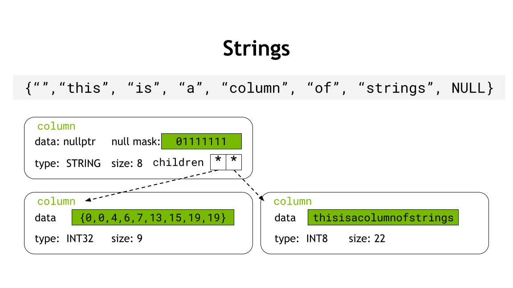

# libcudf C++ Developer Guide

This document serves as a guide for contributors to libcudf C++ code. Refer also to the 
[Documentation Guide](DOCUMENTATION.md) for guidelines on documenting libcudf code.

# Directory Structure and File Naming

External/public libcudf APIs should be grouped based on functionality into an appropriately titled 
header file  in `cudf/cpp/include/cudf/`. For example,  `cudf/cpp/include/cudf/copying.hpp` 
contains the APIs for functions related to copying from one column to another. Note the  `.hpp` 
file extension used to indicate a C++ header file. 

Header files should use the `#pragma once` include guard. 

The naming of external API headers should be consistent with the name of the folder that contains 
the source files that implement the API. For example, the implementation of the APIs found in  
`cudf/cpp/include/cudf/copying.hpp` are located in `cudf/src/copying`. Likewise, the unit tests for 
the APIs reside in `cudf/tests/copying/`.

## File extensions

- `.hpp` : C++ header files
- `.cpp` : C++ source files
- `.cu`  : CUDA C++ source files
- `.cuh` : Headers containing CUDA device code

Only use `.cu` and `.cuh` if necessary. A good indicator is the inclusion of `__device__` and other
symbols that are only recognized by `nvcc`. Also, Thrust APIs executed on a device execution policy,
which should always be `rmm::exec_policy` in libcudf.

# libcudf Data Structures

Application data in libcudf is contained in Columns and Tables, but there are a variety of other
data structures you will use when developing libcudf code.

## Views and Ownership

Resource ownership is an essential concept in `libcudf`. In short, an "owning" object owns a 
resource (such as device memory). It acquires that resource during construction and releases the 
resource in destruction (RAII). A "non-owning" object does not own resources. Any class in `libcudf` 
with the `*_view` suffix is non-owning. For more detail see the 
[`libcudf++` presentation.](https://docs.google.com/presentation/d/1zKzAtc1AWFKfMhiUlV5yRZxSiPLwsObxMlWRWz_f5hA/edit?usp=sharing)

`libcudf` functions typically take views as input (`column_view`, `table_view`, or `scalar_view`)
and produce `unique_ptr`s to owning objects as output. For example, 

```c++
std::unique_ptr<table> sort(table_view const& input);
```

## `rmm::device_memory_resource`<a name="memory_resource"></a>

`libcudf` Allocates all device memory via RMM memory resources (MR). See the 
[RMM documentation](https://github.com/rapidsai/rmm/blob/main/README.md) for details.

### Current Device Memory Resource

RMM provides a "default" memory resource for each device that can be accessed and updated via the
`rmm::mr::get_current_device_resource()` and `rmm::mr::set_current_device_resource(...)` functions, 
respectively. All memory resource parameters should be defaulted to use the return value of 
`rmm::mr::get_current_device_resource()`. 

## `rmm::device_buffer`

The fundamental device memory owning class in `libcudf++`. 

Allocates non-typed, uninitialized device memory using a `device_memory_resource`. If no resource 
is explicitly provided, uses `rmm::mr::get_current_device_resource()`. 

`device_buffer` is movable and copyable. A copy performs a deep copy of the `device_buffer`'s 
device memory, whereas a move moves ownership of the device memory from one `device_buffer` to another.

Example:
```c++
rmm::device_buffer buff(100); // Allocates at least 100 bytes of uninitialized device memory
void * raw_data = buff.data(); // Raw pointer to underlying device memory

rmm::device_buffer copy(buff); // Deep copies `buff` into `copy`
rmm::device_buffer moved_to(std::move(buff)); // Moves contents of `buff` into `moved_to`

custom_memory_resource mr;
rmm::device_buffer custom_buff(100, &mr); // Allocates 100 bytes from the custom memory resource
```

## `cudf::column`

`cudf::column` is a core owning data structure in `libcudf`. Most libcudf public APIs produce either 
a `cudf::column` or a `cudf::table` as output. A `column` contains `device_buffer`s which own the 
device memory for the elements of a column and an optional null indicator bitmask. 

Implicitly convertible to `column_view` and `mutable_column_view`. 

Movable and copyable. A copy performs a deep copy of the column's contents, whereas a move moves 
the contents from one column to another.

Example:
```c++
cudf::column col{...};

cudf::column copy{col}; // Copies the contents of `col`
cudf::column const moved_to{std::move(col)}; // Moves contents from `col`

column_view v = moved_to; // Implicit conversion to non-owning column_view
// mutable_column_view m = moved_to; // Cannot create mutable view to const column
```

A `column` may have nested (child) columns, depending on the data type of the column. For example,
`LIST`, `STRUCT`, and `STRING` type columns.

### `cudf::column_view`

`cudf::column_view` is a core non-owning data structure in `libcudf`. It is an immutable, 
non-owning view of device memory as a column. Most libcudf public APIs take views as inputs.

### `cudf::mutable_column_view`

A *mutable*, non-owning view of device memory as a column. Used for detail APIs and (rare) public
APIs that modify columns in place.

### `cudf::column_device_view`

An immutable, non-owning view of device data as a column of elements that is trivially copyable and 
usable in CUDA device code. Used to pass `column_view` data as input to CUDA kernels and device 
functions (including Thrust algorithms)

### `cudf::mutable_column_device_view`

A mutable, non-owning view of device data as a column of elements that is trivially copyable and 
usable in CUDA device code. Used to pass `column_view` data to be modified on the device by CUDA
kernels and device functions (including Thrust algorithms).

## `cudf::table`

Owning class for a set of `cudf::column`s all with equal number of elements. This is the C++ corollary to a DataFrame. 

Implicitly convertible to `cudf::table_view` and `cudf::mutable_table_view`

Movable and copyable. A copy performs a deep copy of all columns, whereas a move moves all columns from one table to another.

### `cudf::table_view`

An *immutable*, non-owning view of a table. 

### `cudf::mutable_table_view`

A *mutable*, non-owning view of a table. 

## `cudf::scalar`

A `cudf::scalar` is an object that can represent a singular, nullable value of any of the types 
currently supported by cudf. Each type of value is represented by a separate type of scalar class 
which are all derived from `cudf::scalar`. e.g. A `numeric_scalar` holds a single numerical value, 
a `string_scalar` holds a single string. The data for the stored value resides in device memory.

|Value type|Scalar class|Notes|
|-|-|-|
|fixed-width|`fixed_width_scalar<T>`| `T` can be any fixed-width type|
|numeric|`numeric_scalar<T>` | `T` can be `int8_t`, `int16_t`, `int32_t`, `int_64_t`, `float` or `double`|
|fixed-point|`fixed_point_scalar<T> | `T` can be `cudf::numeric::decimal32` or `cudf::numeric::decimal64`|
|timestamp|`timestamp_scalar<T>` | `T` can be `timestamp_D`, `timestamp_s`, etc.|
|duration|`duration_scalar<T>` | `T` can be `duration_D`, `duration_s`, etc.|
|string|`string_scalar`| This class object is immutable|

### Construction
`scalar`s can be created using either their respective constructors or using factory functions like 
`make_numeric_scalar()`, `make_timestamp_scalar()` or `make_string_scalar()`. 

### Casting
All the factory methods return a `unique_ptr<scalar>` which needs to be statically downcasted to 
its respective scalar class type before accessing its value. Their validity (nullness) can be 
accessed without casting. Generally, the value needs to be accessed from a function that is aware 
of the value type e.g. a functor that is dispatched from `type_dispatcher`. To cast to the 
requisite scalar class type given the value type, use the mapping utility `scalar_type_t` provided 
in `type_dispatcher.hpp` : 

```c++
//unique_ptr<scalar> s = make_numeric_scalar(...);

using ScalarType = cudf::scalar_type_t<T>;
// ScalarType is now numeric_scalar<T>
auto s1 = static_cast<ScalarType *>(s.get());
```

### Passing to device
Each scalar type has a corresponding non-owning device view class which allows access to the value 
and its validity from the device. This can be obtained using the function 
`get_scalar_device_view(ScalarType s)`. Note that a device view is not provided for a base scalar 
object, only for the derived typed scalar class objects.

# libcudf++ API and Implementation

## Streams

We do not yet expose CUDA streams in external libcudf APIs. 
However, in order to ease the transition to future use of streams, all libcudf APIs that allocate device memory or execute a kernel should be implemented using asynchronous APIs on the default stream (e.g., stream 0). 

The recommended pattern for doing this is to make the definition of the external API invoke an internal API in the `detail` namespace. The internal `detail` API will have all the same parameters, plus a `rmm::cuda_stream_view` parameter at the end defaulted to `rmm::cuda_stream_default`. 
The implementation should be wholly contained in the `detail` API definition and use only asynchronous versions of CUDA APIs with the defaulted stream parameter. 

In order to make the `detail` API callable from other libcudf functions, it should be exposed in a header placed in the `cudf/cpp/include/detail/` directory.

For example:

```c++
// cpp/include/cudf/header.hpp
void external_function(...);

// cpp/include/cudf/detail/header.hpp
namespace detail{
void external_function(..., rmm::cuda_stream_view stream = rmm::cuda_stream_default)
} // namespace detail

// cudf/src/implementation.cpp
namespace detail{
    // defaulted stream parameter
    void external_function(..., rmm::cuda_stream_view stream){
        // implementation uses stream w/ async APIs
        rmm::device_buffer buff(...,stream);
        CUDA_TRY(cudaMemcpyAsync(...,stream.value()));
        kernel<<<..., stream>>>(...);
        thrust::algorithm(rmm::exec_policy(stream), ...);
    }
} // namespace detail

void external_function(...){
    detail::external_function(...);
}
```

**Note:** It's important to synchronize the stream if *and only if* it is necessary. For example,
when a non-pointer value is returned from the API that is the result of an asynchronous 
device-to-host copy, the stream used for the copy should be synchronized before returning. However,
when a column is returned, the stream should not be synchronized because doing so will break 
asynchrony if and when we add an asynchronous API to libcudf.

**Note:** `cudaDeviceSynchronize()` should *never* be used.
 This limits the ability to do any multi-stream/multi-threaded work with libcudf APIs.

 ### Stream Creation

There may be times in implementing `libcudf` features where it would be advantageous to use streams 
*internally*, i.e., to accomplish overlap in implementing an algorithm. However, dynamically 
creating a stream can be expensive. RMM has recently added a stream pool for this situation to 
avoid dynamic stream creation. However, this is not yet exposed in `libcudf`, so for the time being, 
`libcudf` features should avoid creating streams (even if it is slightly less efficient). It is a 
good idea to leave a `// TODO:` note indicating where using a stream would be beneficial.

## Memory Allocation

Device [memory resources](#memory_resource) are used in libcudf to abstract and control how device memory is allocated. 

### Output Memory

Any libcudf API that allocates memory that is *returned* to a user must accept a pointer to a `device_memory_resource` as the last parameter. Inside the API, this memory resource must be used
to allocate any memory for returned objects. It should therefore be passed into functions whose
outputs will be returned. Example:

```c++
// Returned `column` contains newly allocated memory, 
// therefore the API must accept a memory resource pointer
std::unique_ptr<column> returns_output_memory(..., 
                                              rmm::device_memory_resource * mr = rmm::mr::get_current_device_resource());

// This API does not allocate any new *output* memory, therefore
// a memory resource is unnecessary
void does_not_allocate_output_memory(...);                                              
```

### Temporary Memory

Not all memory allocated within a libcudf API is returned to the caller. Often algorithms must 
allocate temporary, scratch memory for intermediate results. Always use the default resource
obtained from `rmm::mr::get_current_device_resource()` for temporary memory allocations. Example:

```c++
rmm::device_buffer some_function(..., rmm::mr::device_memory_resource mr * = rmm::mr::get_current_device_resource()){
    rmm::device_buffer returned_buffer(..., mr); // Returned buffer uses the passed in MR
    ...
    rmm::device_buffer temporary_buffer(...); // Temporary buffer uses default MR
    ...
    return returned_buffer;
}
```

### Memory Management

RMM provides classes built to use `device_memory_resource`(*)s for device memory allocation with
automated lifetime management:

#### `rmm::device_buffer`
Allocates a specified number of bytes of untyped, uninitialized device memory. 
`rmm::device_buffer` is copyable and movable.

```c++
// Allocates at least 100 bytes of uninitialized device memory 
// using the specified resource and stream
rmm::device_buffer buff(100, stream, mr); 
void * raw_data = buff.data(); // Raw pointer to underlying device memory

rmm::device_buffer copy(buff); // Deep copies `buff` into `copy`
rmm::device_buffer moved_to(std::move(buff)); // Moves contents of `buff` into `moved_to`
```

#### `rmm::device_scalar<T>`
Allocates a single element of the specified type initialized to the specified value. Use this for 
scalar input/outputs into device kernels, e.g., reduction results, null count, etc. This is 
effectively a convenience wrapper around a `rmm::device_vector<T>` of length 1.

```c++
// Allocates device memory for a single int using the specified resource and stream
// and initializes the value to 42
rmm::device_scalar<int> int_scalar{42, stream, mr}; 

// scalar.data() returns pointer to value in device memory
kernel<<<...>>>(int_scalar.data(),...);

// scalar.value() synchronizes the scalar's stream and copies the 
// value from device to host and returns the value
int host_value = int_scalar.value();
```

#### `rmm::device_vector<T>`

Allocates a specified number of elements of the specified type. If no initialization value is 
provided, all elements are default initialized (this incurs a kernel launch).

(*) Note: `rmm::device_vector<T>` is not yet updated to use `device_memory_resource`s, but support 
is forthcoming. Likewise, `device_vector` operations cannot be stream ordered.

#### `rmm::device_uvector<T>`

Similar to a `device_vector`, allocates a contiguous set of elements in device memory but with key 
differences:
- As an optimization, elements are uninitialized and no synchronization occurs at construction.
This limits the types `T` to trivially copyable types.
- All operations are stream ordered (i.e., they accept a `cuda_stream_view` specifying the stream 
on which the operation is performed).

```c++
cuda_stream s;
// Allocates uninitialized storage for 100 `int32_t` elements on stream `s` using the
// default resource
rmm::device_uvector<int32_t> v(100, s);
// Initializes the elements to 0
thrust::uninitialized_fill(thrust::cuda::par.on(s.value()), v.begin(), v.end(), int32_t{0}); 

rmm::mr::device_memory_resource * mr = new my_custom_resource{...};
// Allocates uninitialized storage for 100 `int32_t` elements on stream `s` using the resource `mr`
rmm::device_uvector<int32_t> v2{100, s, mr}; 
```

## Input/Output Style<a name="inout_style"></a>

The preferred style for how inputs are passed in and outputs are returned is the following:
-   Inputs
	- Columns:
		- `column_view const&`
	- Tables:
		- `table_view const&`
    - Scalar:
        - `scalar const&`
    - Everything else:
       - Trivial or inexpensively copied types
          - Pass by value
       - Non-trivial or expensive to copy types
          - Pass by `const&`
-   In/Outs  
	- Columns:
		- `mutable_column_view&`
	- Tables:
		- `mutable_table_view&`
    - Everything else:
        - Pass by via raw pointer
-   Outputs 
	- Outputs should be *returned*, i.e., no output parameters
	- Columns:
		- `std::unique_ptr<column>`
	- Tables:
		- `std::unique_ptr<table>`
    - Scalars:
        - `std::unique_ptr<scalar>`


### Multiple Return Values

Sometimes it is necessary for functions to have multiple outputs. There are a few ways this can be 
done in C++ (including creating a  `struct`  for the output). One convenient way to do this is 
using `std::tie`  and  `std::make_pair`. Note that objects passed to `std::make_pair` will invoke 
either the copy constructor or the move constructor of the object, and it may be preferable to move 
non-trivially copyable objects (and required for types with deleted copy constructors, like 
`std::unique_ptr`).

```c++
std::pair<table, table> return_two_tables(void){
  cudf::table out0;
  cudf::table out1;
  ...
  // Do stuff with out0, out1
  
  // Return a std::pair of the two outputs
  return std::make_pair(std::move(out0), std::move(out1));
}

cudf::table out0;
cudf::table out1;
std::tie(out0, out1) = cudf::return_two_outputs();
```

Note:  `std::tuple`  _could_  be used if not for the fact that Cython does not support 
`std::tuple`. Therefore, libcudf APIs must use  `std::pair`, and are therefore limited to return 
only two objects of different types. Multiple objects of the same type may be returned via a 
`std::vector<T>`.

## Iterator-based interfaces

Increasingly, libcudf is moving toward internal (`detail`) APIs with iterator parameters rather 
than explicit `column`/`table`/`scalar` parameters. As with STL, iterators enable generic 
algorithms to be applied to arbitrary containers. A good example of this is `cudf::copy_if_else`. 
This function takes two inputs, and a Boolean mask. It copies the corresponding element from the 
first or second input depending on whether the mask at that index is true or false. Implementing
`copy_if_else` for all combinations of `column` and `scalar` parameters is simplified by using
iterators in the `detail` API.

```c++
template <typename FilterFn, typename LeftIter, typename RightIter>
std::unique_ptr<column> copy_if_else(
  bool nullable,
  LeftIter lhs_begin,
  LeftIter lhs_end,
  RightIter rhs,
  FilterFn filter,
  ...);
```
`LeftIter` and `RightIter` need only implement the necessary interface for an iterator. `libcudf` 
provides a number of iterator types and utilities that are useful with iterator-based APIs from 
`libcudf` as well as Thrust algorithms. Most are defined in `include/detail/iterator.cuh`. 

### Pair iterator

The pair iterator is used to access elements of nullable columns as a pair containing an element's 
value and validity. `cudf::detail::make_pair_iterator` can be used to create a pair iterator from a 
`column_device_view` or a `cudf::scalar`.

### Null-replacement iterator

This iterator replaces the null/validity value for each element with a specified constant (true or
false). Created using `cudf::detail::make_null_replacement_iterator`.

### Validity iterator

This iterator returns the validity of the underlying element (true or false). Created using 
`cudf::detail::make_validity_iterator`.

### Index-normalizing iterators

The proliferation of data types supported by `libcudf` can result in long compile times. One area
where compile time was a problem is in types used to store indices, which can be any integer type.
The "Indexalator", or index-normalizing iterator (`include/cudf/detail/indexalator.cuh`), can be 
used for index types (integers) without requiring a type-specific instance. It can be used for any 
iterator interface for reading an array of integer values of type `int8`, `int16`, `int32`, 
`int64`, `uint8`, `uint16`, `uint32`, or `uint64`. Reading specific elements always return a 
`cudf::size_type` integer.

Use the `indexalator_factory` to create an appropriate input iterator from a column_view. Example 
input iterator usage:

```c++
auto begin = indexalator_factory::create_input_iterator(gather_map);
auto end   = begin + gather_map.size();
auto result = detail::gather( source, begin, end, IGNORE, stream, mr );
```

Example output iterator usage:

```c++
auto result_itr = indexalator_factory::create_output_iterator(indices->mutable_view());
thrust::lower_bound(rmm::exec_policy(stream),
                    input->begin<Element>(),
                    input->end<Element>(),
                    values->begin<Element>(),
                    values->end<Element>(),
                    result_itr,
                    thrust::less<Element>());
```

## Namespaces


### External
All public libcudf APIs should be placed in the `cudf` namespace*. Example:
```c++
namespace cudf{
   void public_function(...);
} // namespace cudf
```


For most functions, the top-level `cudf` namespace is sufficient. However, for logically grouping a broad set of functions, further namespaces may be used. For example, there are numerous functions that are specific to columns of Strings. These functions are put in the `cudf::strings::` namespace. Similarly, functionality used exclusively for unit testing is placed in the `cudf::test::` namespace. 


### Internal

Many functions are not meant for public use. Such functions should be placed in either the `detail` or an *anonymous* namespace depending on the situation.

#### `detail`

For functions or objects that will be used across *multiple* translation units (i.e., source files), they should be exposed in an internal header file and placed in the `detail` namespace. Example:
```c++
// some_utilities.hpp
namespace cudf{
namespace detail{
void reusable_helper_function(...);
} // namespace detail
} // namespace cudf
```
#### Anonymous 

If a function or class will only be used in a *single* translation unit, it should be put in an *anonymous* namespace within source file where it is used. Example:
```c++
// some_file.cpp
namespace{
void isolated_helper_function(...);
} // anonymous namespace
```

[**Anonymous namespaces should *never* be used in a header file.**](https://wiki.sei.cmu.edu/confluence/display/cplusplus/DCL59-CPP.+Do+not+define+an+unnamed+namespace+in+a+header+file) 


# Error Handling

## Runtime Conditions

For ensuring runtime conditions necessary for correct execution, the `CUDF_EXPECTS` macro should be used.

Example usage:
```c++
CUDF_EXPECTS(lhs.type() == rhs.type(), "Column type mismatch");
```

The first argument is the conditional expression expected to resolve to  `true`  under normal conditions. If the conditional evaluates to  `false`, then an error has occurred and an instance of  `cudf::logic_error`  is thrown. The second argument to  `CUDF_EXPECTS`  is a short description of the error that has occurred and is used for the exceptions `what()` message. 

There are times where a particular code path, if reached, should indicate an error no matter what. For example, in the  `default`  case of a  `switch`  statement where the only valid code paths are in one of the  `case`  statements.

For these cases, the  `CUDF_FAIL`  convenience macro should be used. This is effectively the same as doing  `CUDF_EXPECTS(false, reason)`.

Example:
```c++
CUDF_FAIL("This code path should not be reached.");
```

### CUDA Error Checking

Checking for the successful completion of CUDA runtime API functions should be done via the  `CUDA_TRY`  macro. This macro throws a `cudf::cuda_error` exception if the return value of the CUDA API does not return  `cudaSuccess`. The thrown exception will include a description of the CUDA error code that occurred in it's  `what()`  message.

Example:

```c++
CUDA_TRY( cudaMemcpy(&dst, &src, num_bytes) );
```


## Compile-Time Conditions

Some conditions can be verified at compile time. These should be done using `static_assert`. For example,

```c++
template <typename T>
void trivial_types_only(T t){
   static_assert(std::is_trivial<T>::value, "This function requires a trivial type.");
...
}
```


# Type Dispatcher

The device memory for a column's elements is stored in a `void*`. 
This is known as *type-erasure*, because the data's type we are pointing to is not known at compile time.
In order to determine the type, we must use the runtime information stored in the columns `type()`. 
We can then use that type information to reconstruct the data's type `T`, i.e., casting the `void*` to the appropriate `T*`.

This type "reconstruction" or *type dispatching* is pervasive throughout `libcudf`. 
The `type_dispatcher` is a centralized utility that automates the process of mapping the runtime type information in `data_type` to a concrete C++ type.

At a high level, you give the `type_dispatcher` a `data_type` and a function object (sometimes known as a *functor*) with an `operator()` template. 
Then, based on the value of `data_type::id()`, it will invoke the corresponding instantiation of the `operator()` template. 

This simplified example of how the `type_dispatcher` works shows how the value of `data_type::id()` determines which instantiation of the `F::operator()` template is invoked. 
```c++
template <typename F>
void type_dispatcher(data_type t, F f){
    switch(t.id())
       case type_id::INT32: f.template operator()<int32_t>()
       case type_id::INT64: f.template operator()<int64_t>()
       case type_id::FLOAT: f.template operator()<float>()
       ...
}
```

The below example shows a function object called `size_of_functor` that returns the size of the dispatched type:

```c++
struct size_of_functor{
template <typename T>
int operator()(){ return sizeof(T); }
};
cudf::type_dispatcher(data_type{type_id::INT8}, size_of_functor{});  // returns 1
cudf::type_dispatcher(data_type{type_id::INT32}, size_of_functor{});  // returns 4
cudf::type_dispatcher(data_type{type_id::FLOAT64}, size_of_functor{});  // returns 8
```

By default, the `type_dispatcher` uses `cudf::type_to_id<t>` to provide the mapping
of `cudf::type_id`s to dispatched C++ types.
However, this mapping may be customized by explicitly specifying a user-defined trait for the `IdTypeMap`.
For example, to always dispatch `int32_t` for all values of `cudf::type_id`:

```c++
template<cudf::type_id t> struct always_int{ using type = int32_t; }

// This will always invoke `operator()<int32_t>`
cudf::type_dispatcher<always_int>(data_type, f);
```
## Specializing Type Dispatched Code Paths
It is often necessary to customize the dispatched `operator()` for different types. 
This can be done in several ways.

The first method is to use explicit, full template specialization. This is useful
for specializing behavior for single types. For example, a function object that
prints `"int32_t"` or `"double"` when invoked with either of those types, else it
prints `"unhandled type"`:

```c++
struct type_printer {
template <typename ColumnType>
void operator()() { std::cout << "unhandled type\n"; }
};

// Due to a bug in g++, explicit member function specializations need to be
// defined outside of the class definition
template <>
void type_printer::operator()<int32_t>() { std::cout << "int32_t\n"; }

template <>
void type_printer::operator()<double>() { std::cout << "double\n"; }
```

A second method is to use SFINAE with `std::enable_if_t`. This is useful for
partially specializing for a set of types that share some property. For example, a
functor that prints `integral` or `floating point` for integral or floating
point types:

```c++
struct integral_or_floating_point {
template <typename ColumnType,
          std::enable_if_t<not std::is_integral<ColumnType>::value and
                           not std::is_floating_point<ColumnType>::value>* = nullptr> 
void operator()() { std::cout << "neither integral nor floating point\n"; }

template <typename ColumnType,
          std::enable_if_t<std::is_integral<ColumnType>::value>* = nullptr>
void operator()() { std::cout << "integral\n"; }

template < typename ColumnType,
           std::enable_if_t<std::is_floating_point<ColumnType>::value>* = nullptr> 
void operator()() { std::cout << "floating point\n"; }
};
``` 
For more info on SFINAE and `std::enable_if`, see https://eli.thegreenplace.net/2014/sfinae-and-enable_if

There are a number of traits defined in `cpp/include/cudf/utilities/traits.hpp` that are useful for partially specializing dispatched function objects. 
For example `is_numeric<T>()` can be used to specialize for any numeric type.


# Testing

Unit tests in libcudf are written using [Google Test](https://github.com/google/googletest/blob/master/googletest/docs/primer.md).

**Important:** Instead of including `gtest/gtest.h` directly, use `#include <cudf_test/cudf_gtest.hpp>`.

## Directory and File Naming

The naming of unit test directories and source files should be consistent with the feature being tested.

For example, the tests for APIs in `copying.hpp` should live in `cudf/cpp/tests/copying`.
Each feature (or set of related features) should have its own test source file named `<feature>_tests.cu/cpp`.
For example, for `cudf/cpp/src/copying/scatter.cu` should have its associated tests in `cudf/cpp/tests/copying/scatter_tests.cu`.

In the interest of improving compile time, whenever possible, test source files should be `.cpp` files.
This is because `nvcc` is generally slower than `gcc` in compiling host code.

## Base Fixture

All libcudf unit tests should make use of a GTest ["Test Fixture"](https://github.com/google/googletest/blob/master/googletest/docs/primer.md#test-fixtures-using-the-same-data-configuration-for-multiple-tests-same-data-multiple-tests).
Even if the fixture is empty, it should inherit from the base fixture `cudf::test::BaseFixture` found in `include/utilities/test/base_fixture.hpp`.
This is to ensure that RMM is properly initialized/finalized. 
`cudf::test::BaseFixture` already inherits from `::testing::Test` and therefore it is not necessary for your test fixtures to inherit from it.

Example:
```c++
class MyTestFiture : public cudf::test::BaseFixture {...};
```

## Typed Tests

In libcudf we must ensure that features work across all of the types we support.
In order to automate the process of running the same tests across multiple types, we make use of GTest's [Typed Tests](https://github.com/google/googletest/blob/master/googletest/docs/advanced.md#typed-tests).
Typed tests allow you to write a test once and run it across all types in a list of types.

For example:
```c++
// Fixture must be a template
template <typename T>
class TypedTestFixture : cudf::test::BaseFixture {...};
using TestTypes = cudf::test:Types<int,float,double>; // Notice custom cudf type list type
TYPED_TEST_CASE(TypedTestFixture,TestTypes);
TYPED_TEST(TypedTestFixture, FirstTest){
    // Access the current type using `TypeParam`
    using T = TypeParam;
}
```
To specify the list of types to use, instead of GTest's `::testing::Types<...>`, libcudf provides `cudf::test::Types<...>` which is a custom, drop-in replacement for `::testing::Types`.
In this example, all tests using the `TypedTestFixture` fixture will run once for each type in the list defined in `TestTypes` (`int, float, double`).

### Type Lists

The list of types that are used in tests should be consistent across all tests.
To ensure consistency, several sets of common type lists are provided in `include/utilities/test/type_lists.hpp`.
For example, `NumericTypes` gives a type list of all numeric types, or `FixedWidthTypes` gives a list of all fixed-width element types, and `AllTypes` provides a list of every element type libcudf supports.
Example:
```c++
#include <cudf_test/type_lists.hpp>

// All tests using TypeTestFixture will be invoked once for each numeric type
TYPED_TEST_CASE(TypedTestFixture, cudf::test::NumericTypes);
```
Therefore, whenever possible, avoid creating a custom type list and instead use one of the ones provided in `include/utilities/test/type_lists.hpp`.

#### Advanced Type Lists

Sometimes it is necessary to generate more advanced type lists than the simple list of single types in the `TypeList` example above. 
libcudf provides a set of meta-programming utilities in `include/utilities/test/type_list_utilities.hpp` for generating and composing more advanced type lists;

For example, it may be useful to generate a type list where each element in the list is *two* types, i.e., a *nested type list*.
In a nested type list, each element in the list is itself another list. 
In order to access the type within the nested list, use `GetType<NestedList, N>`, which will return the `N`th type in the nested list.


Imagine testing all possible two-type combinations of `<int,float>`.

This could be done manually:
```c++
using namespace cudf::test;
template <typename TwoTypes>
TwoTypesFixture : BaseFixture{...};
using TwoTypesList = Types< Types<int, int>, Types<int, float>, 
                            Types<float, int>, Types<float, float> >;
TYPED_TEST_CASE(TwoTypesFixture, TwoTypesList);
TYPED_TEST(TwoTypesFixture, FirstTest){
    // TypeParam is a list of two types, i.e., a "nested" type list
    // Use `cudf::test::GetType` to retrieve the individual types
    using FirstType = GetType<TypeParam,0>;
    using SecondType = GetType<TypeParam,1>;
}
```

In the above example, one had to manually specify the cross product of combinations of `<int,float>` and `<float,int>`.
However, `CrossProduct` is a utility in `type_list_utilities.hpp` which materializes the cross product automatically:
```c++
using TwoTypesList = Types< Types<int, int>, Types<int, float>, 
                            Types<float, int>, Types<float, float> >;
using CrossProductTypeList = CrossProduct< Types<int, float>, Types<int, float> >;
// TwoTypesList and CrossProductTypeList are identical
```
`CrossProduct` can be used with an arbitrary number of type lists to generate nested type lists of 2 or more types. 
**However**, overuse of `CrossProduct` can dramatically inflate compile time. 
For example, the cross product of two type lists of size `n` and `m` will result in a new list with `n*m` nested type lists.
This means `n*m` templates will be instantiated.
`n` and `m` do not need to be large before compile time becomes unreasonable.

There are a number of other utilities in `type_list_utilities.hpp`. 
For more details, see the documentation in that file and their associated tests in `cudf/cpp/tests/utilities_tests/type_list_tests.cpp`.

## Utilities

libcudf provides a number of utilities that make common operations needed in testing more convenient. 
These can be found in `include/utilities/test/`. 
Before creating your own test utilities, look to see if one already exists that does what you need.
If not, consider adding a new utility to do what you need.
However, make sure that the utility is generic enough to be useful for other tests and is not overly tailored to your specific testing need.

### Column Wrappers

In order to make generating input columns easier, libcudf provides the `*_column_wrapper` classes in `include/utilities/test/column_wrapper.hpp`.
These classes wrap a `cudf::column` and provide constructors for initializing a `cudf::column` object usable with libcudf APIs.
Any `*_column_wrapper` class is implicitly convertible to a `column_view` or `mutable_column_view` and therefore may be transparently passed into any API expecting a `column_view` or `mutable_column_view` argument.

#### `fixed_width_column_wrapper`

The `fixed_width_column_wrapper` class should be used for constructing and initializing a column of any fixed-width element type, e.g., numeric types, timestamp types, boolean, etc.

`fixed_width_column_wrapper` provides constructors that accept an iterator range to generate each element in the column.
For nullable columns, an additional iterator can be provided indicating the validity of each element.
There are also constructors that accept a `std::initializer_list<T>` for the column elements and optionally for the validity of each element.

Example:
```c++
// Creates a non-nullable column of INT32 elements with 5 elements: {0, 1, 2, 3, 4}
auto elements = make_counting_transform_iterator(0, [](auto i){return i;});
fixed_width_column_wrapper<int32_t> w(elements, elements + 5);

// Creates a nullable column of INT32 elements with 5 elements: {null, 1, null, 3, null}
auto elements = make_counting_transform_iterator(0, [](auto i){return i;});
auto validity = make_counting_transform_iterator(0, [](auto i){return i%2;})
fixed_width_column_wrapper<int32_t> w(elements, elements + 5, validity);

// Creates a non-nullable INT32 column with 4 elements: {1, 2, 3, 4}
fixed_width_column_wrapper<int32_t> w{{1, 2, 3, 4}};

// Creates a nullable INT32 column with 4 elements: {1, NULL, 3, NULL}
fixed_width_column_wrapper<int32_t> w{ {1,2,3,4}, {1, 0, 1, 0}};
```

#### `strings_column_wrapper`

The `strings_column_wrapper` class should be used for creating columns of strings. It provides constructors that accept an iterator range to generate each string in the column. 
For nullable columns, an additional iterator can be provided indicating the validity of each string.
There are also constructors that accept a `std::initializer_list<std::string>` for the column's strings and optionally for the validity of each element.

Example:
```c++
// Creates a non-nullable STRING column with 7 string elements: 
// {"", "this", "is", "a", "column", "of", "strings"}
std::vector<std::string> strings{"", "this", "is", "a", "column", "of", "strings"};
strings_column_wrapper s(strings.begin(), strings.end());

// Creates a nullable STRING column with 7 string elements: 
// {NULL, "this", NULL, "a", NULL, "of", NULL}
std::vector<std::string> strings{"", "this", "is", "a", "column", "of", "strings"};
auto validity = make_counting_transform_iterator(0, [](auto i){return i%2;});
strings_column_wrapper s(strings.begin(), strings.end(), validity);

// Creates a non-nullable STRING column with 7 string elements: 
// {"", "this", "is", "a", "column", "of", "strings"}
strings_column_wrapper s({"", "this", "is", "a", "column", "of", "strings"});

// Creates a nullable STRING column with 7 string elements: 
// {NULL, "this", NULL, "a", NULL, "of", NULL}
auto validity = make_counting_transform_iterator(0, [](auto i){return i%2;});
strings_column_wrapper s({"", "this", "is", "a", "column", "of", "strings"}, validity);
```

### Column Utilities

### `expect_columns_equal`

A common operation in testing is verifying that two columns are equal to another and another.
The utility function `expect_columns_equal` in `include/utilities/test/column_utilities.cuh` should be used for this purpose.
It uses GTest macros to verify the equality of two columns metadata and the contents of each column.


## Strings Support<a name="string_support"></a>

In order to represent variable width strings, libcudf uses a *compound* column (i.e., column with children).
The parent column's type is `STRING` and contains no data, but contains the count of the number of strings and the bitmask representing the validity of each string element.
The parent has two children.
The first is a non-nullable column of `INT32` elements that indicate the offset to beginning of each string in a dense column of characters.
The second is a non-nullable column of `INT8` elements of all the characters across all the strings packed together. With this representation, `characters[offsets[i]]` is the first character of string `i`, and the size of string `i` is given by `offsets[i+1] - offsets[i]`.

The image below shows an example of this compound column representation of strings:




The first challenge with strings columns is that it is effectively impossible to do any operation that modifies the length of any string in-place.
For example, consider trying to append the character `'a'` to the end of each string.
This would require dynamically resizing the characters column to allow inserting `'a'` at the end of each string, and then modifying the offsets column to indicate the new size of each element. As a result, every operation that can modify the strings in the column must be out-of-place. 

The second challenge is that in an out-of-place operation on a string column, unlike with fixed-width elements, the size of the output cannot be known *a priori*. 
For example, consider scattering into a column of strings:
```c++
destination:    {"this", "is", "a", "column", "of", "strings"}
scatter_map:    {1, 3, 5}
scatter_values: {"red", "green", "blue"}

result:         {"this", "red", "a", "green", "of", "blue"}
```

In this example, the strings `"red", "green", "blue"` will respectively be scattered into positions `1,3,5` of `destination`. 
Recall from above that this operation cannot be done in-place, therefore `result` will be generated by selectively copying strings from `destination` and `scatter_values`. 
Notice that `result`'s child column of characters will require storage for `19` characters. 
However, there is no way to know ahead of time that `result` will require `19` characters. 
Therefore, most operations that produce a new output column of strings use a two-phase approach:

1. First, determine the number and size of each string in the result
    - This amounts to materializing the output's offsets column 
2. Second, allocate sufficient storage for all of the output characters and materialize each output string

In scatter, the first phase consists of using the `scatter_map` to determine if string `i` in the output will come from `destination` or from `scatter_values` and use the corresponding size(s) to materialize the offsets column and determine the size of the output. Then, in the second phase, sufficient storage is allocated for the output's characters, and then the characters are filled with the corresponding strings from either `destination` or `scatter_values`.


### `cudf::string_view`

This is the data type for a `STRING` column like `int32_t` is the data type for an `INT32` column. As it's name implies, this is a read-only object instance that points to device memory inside the strings column. It's lifespan is the same (or less) as the column it was created from.

Use the `column_device_view::element` method to access an individual row element. Like any other column, do not call `element()` on a row that is null. 
```
   column_device_view d_strings;
   ...
   if( d_strings.is_valid(row_index) ) {
      string_view d_str = d_strings.element<string_view>(row_index);
      ...
   }
```
A null string is not the same as an empty string. Use the `string_scalar` class if you need an instance of a class object to represent a null string.

The `string_view` contains comparison operators `<,>,==,<=,>=` so they can be used in many cudf functions like `sort` without specific strings code.
The data for a `string_view` instance is required to be [UTF-8](#UTF-8) and all operators and methods expect this encoding. Unless documented otherwise,
position and length parameters are specified in characters and not bytes.
The class also includes a `string_view::const_iterator` which can be used to navigate through individual characters within the string.

The `type-dispatcher` dispatches to the `string_view` data type when invoked on a `STRING` column.


### UTF-8

The cudf strings column only supports UTF-8 encoding for strings data. [UTF-8](https://en.wikipedia.org/wiki/UTF-8) is a variable-length character encoding where each character can be 1-4 bytes. This means the length of a string is not the same as its size in bytes. For this reason, it recommended to use the `string_view` class to access these characters for most operations.

The `string_view.cuh` also includes some utility methods for reading and writing (`to_char_utf8/from_char_utf8`) individual UTF-8 characters to/from byte arrays.
