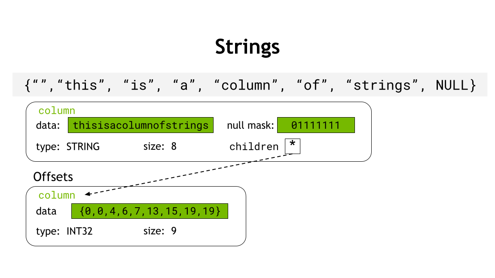

# libcudf C++ Developer Guide

This document serves as a guide for contributors to libcudf C++ code. Developers should also refer
to these additional files for further documentation of libcudf best practices.

* [Documentation Guide](DOCUMENTATION.md) for guidelines on documenting libcudf code.
* [Testing Guide](TESTING.md) for guidelines on writing unit tests.
* [Benchmarking Guide](BENCHMARKING.md) for guidelines on writing unit benchmarks.

# Overview

libcudf is a C++ library that provides GPU-accelerated data-parallel algorithms for processing
column-oriented tabular data. libcudf provides algorithms including slicing, filtering, sorting,
various types of aggregations, and database-type operations such as grouping and joins. libcudf
serves a number of clients via multiple language interfaces, including Python and Java. Users may
also use libcudf directly from C++ code.

## Lexicon

This section defines terminology used within libcudf.

### Column

A column is an array of data of a single type. Along with Tables, columns are the fundamental data
structures used in libcudf. Most libcudf algorithms operate on columns. Columns may have a validity
mask representing whether each element is valid or null (invalid). Columns of nested types are
supported, meaning that a column may have child columns. A column is the C++ equivalent to a cuDF
Python [Series](https://docs.rapids.ai/api/cudf/stable/api_docs/series.html).

### Element

An individual data item within a column. Also known as a row.

### Scalar

A type representing a single element of a data type.

### Table

A table is a collection of columns with equal number of elements. A table is the C++ equivalent to
a cuDF Python [DataFrame](https://docs.rapids.ai/api/cudf/stable/api_docs/dataframe.html).

### View

A view is a non-owning object that provides zero-copy access (possibly with slicing or offsets) to
data owned by another object. Examples are column views and table views.

# Directory Structure and File Naming

External/public libcudf APIs are grouped based on functionality into an appropriately titled
header file in `cudf/cpp/include/cudf/`. For example, `cudf/cpp/include/cudf/copying.hpp`
contains the APIs for functions related to copying from one column to another. Note the `.hpp`
file extension used to indicate a C++ header file.

Header files should use the `#pragma once` include guard.

The naming of external API headers should be consistent with the name of the folder that contains
the source files that implement the API. For example, the implementation of the APIs found in
`cudf/cpp/include/cudf/copying.hpp` are located in `cudf/src/copying`. Likewise, the unit tests for
the APIs reside in `cudf/tests/copying/`.

Internal API headers containing `detail` namespace definitions that are used across translation
units inside libcudf should be placed in `include/cudf/detail`.

## File extensions

- `.hpp` : C++ header files
- `.cpp` : C++ source files
- `.cu`  : CUDA C++ source files
- `.cuh` : Headers containing CUDA device code

Only use `.cu` and `.cuh` if necessary. A good indicator is the inclusion of `__device__` and other
symbols that are only recognized by `nvcc`. Another indicator is Thrust algorithm APIs with a device
execution policy (always `rmm::exec_policy` in libcudf).

## Code and Documentation Style and Formatting

libcudf code uses [snake_case](https://en.wikipedia.org/wiki/Snake_case) for all names except in a
few cases: template parameters, unit tests and test case names may use Pascal case, aka
[UpperCamelCase](https://en.wikipedia.org/wiki/Camel_case). We do not use
[Hungarian notation](https://en.wikipedia.org/wiki/Hungarian_notation), except sometimes when naming
device data variables and their corresponding host copies. Private member variables are typically
prefixed with an underscore.

```c++
template <typename IteratorType>
void algorithm_function(int x, rmm::cuda_stream_view s, rmm::device_async_resource_ref mr)
{
  ...
}

class utility_class
{
  ...
private:
  int _rating{};
  std::unique_ptr<cudf::column> _column{};
}

TYPED_TEST_SUITE(RepeatTypedTestFixture, cudf::test::FixedWidthTypes);

TYPED_TEST(RepeatTypedTestFixture, RepeatScalarCount)
{
  ...
}
```

C++ formatting is enforced using `clang-format`. You should configure `clang-format` on your
machine to use the `cudf/cpp/.clang-format` configuration file, and run `clang-format` on all
changed code before committing it. The easiest way to do this is to configure your editor to
"format on save."

Aspects of code style not discussed in this document and not automatically enforceable are typically
caught during code review, or not enforced.

### C++ Guidelines

In general, we recommend following
[C++ Core Guidelines](https://isocpp.github.io/CppCoreGuidelines/CppCoreGuidelines). We also
recommend watching Sean Parent's [C++ Seasoning talk](https://www.youtube.com/watch?v=W2tWOdzgXHA),
and we try to follow his rules: "No raw loops. No raw pointers. No raw synchronization primitives."

 * Prefer algorithms from STL and Thrust to raw loops.
 * Prefer libcudf and RMM [owning data structures and views](#libcudf-data-structures) to raw
   pointers and raw memory allocation.
 * libcudf doesn't have a lot of CPU-thread concurrency, but there is some. And currently libcudf
   does use raw synchronization primitives. So we should revisit Parent's third rule and improve
   here.

Additional style guidelines for libcudf code:

 * Prefer "east const", placing `const` after the type. This is not
   automatically enforced by `clang-format` because the option
   `QualifierAlignment: Right` has been observed to produce false negatives and
   false positives.
 * [NL.11: Make Literals
   Readable](https://isocpp.github.io/CppCoreGuidelines/CppCoreGuidelines#nl11-make-literals-readable):
   Decimal values should use integer separators every thousands place, like
   `1'234'567`. Hexadecimal values should use separators every 4 characters,
   like `0x0123'ABCD`.

Documentation is discussed in the [Documentation Guide](DOCUMENTATION.md).

### Includes

The following guidelines apply to organizing `#include` lines.

 * Group includes by library (e.g. cuDF, RMM, Thrust, STL). `clang-format` will respect the
   groupings and sort the individual includes within a group lexicographically.
 * Separate groups by a blank line.
 * Order the groups from "nearest" to "farthest". In other words, local includes, then includes
   from other RAPIDS libraries, then includes from related libraries, like `<thrust/...>`, then
   includes from dependencies installed with cuDF, and then standard headers (for example
   `<string>`, `<iostream>`).
 * We use clang-format for grouping and sorting headers automatically. See the
   `cudf/cpp/.clang-format` file for specifics.
 * Use `<>` for all includes except for internal headers that are not in the `include`
   directory. In other words, if it is a cuDF internal header (e.g. in the `src` or `test`
   directory), the path will not start with `cudf` (e.g. `#include <cudf/some_header.hpp>`) so it
   should use quotes. Example: `#include "io/utilities/hostdevice_vector.hpp"`.
 * `cudf_test` and `nvtext` are separate libraries within the `libcudf` repo. As such, they have
   public headers in `include` that should be included with `<>`.
 * Tools like `clangd` often auto-insert includes when they can, but they usually get the grouping
   and brackets wrong. Correct the usage of quotes or brackets and then run clang-format to correct
   the grouping.
 * Always check that includes are only necessary for the file in which they are included.
   Try to avoid excessive including especially in header files. Double check this when you remove
   code.
 * Avoid relative paths with `..` when possible. Paths with `..` are necessary when including
   (internal) headers from source paths not in the same directory as the including file,
   because source paths are not passed with `-I`.
 * Avoid including library internal headers from non-internal files. For example, try not to include
   headers from libcudf `src` directories in tests or in libcudf public headers. If you find
   yourself doing this, start a discussion about moving (parts of) the included internal header
   to a public header.

# libcudf Data Structures

Application data in libcudf is contained in Columns and Tables, but there are a variety of other
data structures you will use when developing libcudf code.

## Views and Ownership

Resource ownership is an essential concept in libcudf. In short, an "owning" object owns a
resource (such as device memory). It acquires that resource during construction and releases the
resource in destruction ([RAII](https://en.cppreference.com/w/cpp/language/raii)). A "non-owning"
object does not own resources. Any class in libcudf with the `*_view` suffix is non-owning. For more
detail see the [`libcudf` presentation.](https://docs.google.com/presentation/d/1zKzAtc1AWFKfMhiUlV5yRZxSiPLwsObxMlWRWz_f5hA/edit?usp=sharing)

libcudf functions typically take views as input (`column_view` or `table_view`)
and produce `unique_ptr`s to owning objects as output. For example,

```c++
std::unique_ptr<table> sort(table_view const& input);
```

## Memory Resources

libcudf allocates all device memory via RMM memory resources (MR) or CUDA MRs. Either type
can be passed to libcudf functions via `rmm::device_async_resource_ref` parameters. See the
[RMM documentation](https://github.com/rapidsai/rmm/blob/main/README.md) for details.

### Current Device Memory Resource

RMM provides a "default" memory resource for each device that can be accessed and updated via the
`rmm::mr::get_current_device_resource()` and `rmm::mr::set_current_device_resource(...)` functions,
respectively. All memory resource parameters should be defaulted to use the return value of
`rmm::mr::get_current_device_resource()`.

### Resource Refs

Memory resources are passed via resource ref parameters. A resource ref is a memory resource wrapper
that enables consumers to specify properties of resources that they expect. These are defined
in the `cuda::mr` namespace of libcu++, but RMM provides some convenience wrappers in
`rmm/resource_ref.hpp`:
 - `rmm::device_resource_ref` accepts a memory resource that provides synchronous allocation
    of device-accessible memory.
 - `rmm::device_async_resource_ref` accepts a memory resource that provides stream-ordered allocation
    of device-accessible memory.
 - `rmm::host_resource_ref` accepts a memory resource that provides synchronous allocation of host-
    accessible memory.
 - `rmm::host_async_resource_ref` accepts a memory resource that provides stream-ordered allocation
    of host-accessible memory.
 - `rmm::host_device_resource_ref` accepts a memory resource that provides synchronous allocation of
    host- and device-accessible memory.
 - `rmm::host_async_resource_ref` accepts a memory resource that provides stream-ordered allocation
    of host- and device-accessible memory.

See the libcu++ [docs on `resource_ref`](https://nvidia.github.io/cccl/libcudacxx/extended_api/memory_resource/resource_ref.html) for more information.

## cudf::column

`cudf::column` is a core owning data structure in libcudf. Most libcudf public APIs produce either
a `cudf::column` or a `cudf::table` as output. A `column` contains `device_buffer`s which own the
device memory for the elements of a column and an optional null indicator bitmask.

Implicitly convertible to `column_view` and `mutable_column_view`.

Movable and copyable. A copy performs a deep copy of the column's contents, whereas a move moves
the contents from one column to another.

Example:

```c++
cudf::column col{...};

cudf::column copy{col}; // Copies the contents of `col`
cudf::column const moved_to{std::move(col)}; // Moves contents from `col`

column_view v = moved_to; // Implicit conversion to non-owning column_view
// mutable_column_view m = moved_to; // Cannot create mutable view to const column
```

A `column` may have nested (child) columns, depending on the data type of the column. For example,
`LIST`, `STRUCT`, and `STRING` type columns.

### cudf::column_view

`cudf::column_view` is a core non-owning data structure in libcudf. It is an immutable,
non-owning view of device memory as a column. Most libcudf public APIs take views as inputs.

A `column_view` may be a view of a "slice" of a column. For example, it might view rows 75-150 of a
column with 1000 rows. The `size()` of this `column_view` would be `75`, and accessing index `0` of
the view would return the element at index `75` of the owning `column`. Internally, this is
implemented by storing in the view a pointer, an offset, and a size. `column_view::data<T>()`
returns a pointer iterator to `column_view::head<T>() + offset`.

### cudf::mutable_column_view

A *mutable*, non-owning view of device memory as a column. Used for detail APIs and (rare) public
APIs that modify columns in place.

### cudf::column_device_view

An immutable, non-owning view of device data as a column of elements that is trivially copyable and
usable in CUDA device code. Used to pass `column_view` data as input to CUDA kernels and device
functions (including Thrust algorithms)

### cudf::mutable_column_device_view

A mutable, non-owning view of device data as a column of elements that is trivially copyable and
usable in CUDA device code. Used to pass `column_view` data to be modified on the device by CUDA
kernels and device functions (including Thrust algorithms).

## cudf::table

Owning class for a set of `cudf::column`s all with equal number of elements. This is the C++
equivalent to a data frame.

Implicitly convertible to `cudf::table_view` and `cudf::mutable_table_view`

Movable and copyable. A copy performs a deep copy of all columns, whereas a move moves all columns
from one table to another.

### cudf::table_view

An *immutable*, non-owning view of a table.

### cudf::mutable_table_view

A *mutable*, non-owning view of a table.

## cudf::size_type

The `cudf::size_type` is the type used for the number of elements in a column, offsets to elements
within a column, indices to address specific elements, segments for subsets of column elements, etc.
It is equivalent to a signed, 32-bit integer type and therefore has a maximum value of 2147483647.
Some APIs also accept negative index values and those functions support a minimum value of
-2147483648. This fundamental type also influences output values not just for column size limits
but for counting elements as well.

## Spans

libcudf provides `span` classes that mimic C++20 `std::span`, which is a lightweight
view of a contiguous sequence of objects. libcudf provides two classes, `host_span` and
`device_span`, which can be constructed from multiple container types, or from a pointer
(host or device, respectively) and size, or from iterators. `span` types are useful for defining
generic (internal) interfaces which work with multiple input container types. `device_span` can be
constructed from `thrust::device_vector`, `rmm::device_vector`, or `rmm::device_uvector`.
`host_span` can be constructed from `thrust::host_vector`, `std::vector`, or `std::basic_string`.

If you are defining internal (detail) functions that operate on vectors, use spans for the input
vector parameters rather than a specific vector type, to make your functions more widely applicable.

When a `span` refers to immutable elements, use `span<T const>`, not `span<T> const`. Since a span
is lightweight view, it does not propagate `const`-ness. Therefore, `const` should be applied to
the template type parameter, not to the `span` itself. Also, `span` should be passed by value
because it is a lightweight view. APIS in libcudf that take spans as input will look like the
following function that copies device data to a host `std::vector`.

```c++
template <typename T>
std::vector<T> make_std_vector_async(device_span<T const> v, rmm::cuda_stream_view stream)
```

## cudf::scalar

A `cudf::scalar` is an object that can represent a singular, nullable value of any of the types
currently supported by cudf. Each type of value is represented by a separate type of scalar class
which are all derived from `cudf::scalar`. e.g. A `numeric_scalar` holds a single numerical value,
a `string_scalar` holds a single string. The data for the stored value resides in device memory.

A `list_scalar` holds the underlying data of a single list. This means the underlying data can be
any type that cudf supports. For example, a `list_scalar` representing a list of integers stores a
`cudf::column` of type `INT32`. A `list_scalar` representing a list of lists of integers stores a
`cudf::column` of type `LIST`, which in turn stores a column of type `INT32`.

|Value type|Scalar class|Notes|
|-|-|-|
|fixed-width|`fixed_width_scalar<T>`| `T` can be any fixed-width type|
|numeric|`numeric_scalar<T>` | `T` can be `int8_t`, `int16_t`, `int32_t`, `int_64_t`, `float` or `double`|
|fixed-point|`fixed_point_scalar<T>` | `T` can be `numeric::decimal32` or `numeric::decimal64`|
|timestamp|`timestamp_scalar<T>` | `T` can be `timestamp_D`, `timestamp_s`, etc.|
|duration|`duration_scalar<T>` | `T` can be `duration_D`, `duration_s`, etc.|
|string|`string_scalar`| This class object is immutable|
|list|`list_scalar`| Underlying data can be any type supported by cudf |

### Construction
`scalar`s can be created using either their respective constructors or using factory functions like
`make_numeric_scalar()`, `make_timestamp_scalar()` or `make_string_scalar()`.

### Casting
All the factory methods return a `unique_ptr<scalar>` which needs to be statically downcasted to
its respective scalar class type before accessing its value. Their validity (nullness) can be
accessed without casting. Generally, the value needs to be accessed from a function that is aware
of the value type e.g. a functor that is dispatched from `type_dispatcher`. To cast to the
requisite scalar class type given the value type, use the mapping utility `scalar_type_t` provided
in `type_dispatcher.hpp` :

```c++
//unique_ptr<scalar> s = make_numeric_scalar(...);

using ScalarType = cudf::scalar_type_t<T>;
// ScalarType is now numeric_scalar<T>
auto s1 = static_cast<ScalarType *>(s.get());
```

### Passing to device
Each scalar type, except `list_scalar`, has a corresponding non-owning device view class which
allows access to the value and its validity from the device. This can be obtained using the function
`get_scalar_device_view(ScalarType s)`. Note that a device view is not provided for a base scalar
object, only for the derived typed scalar class objects.

The underlying data for `list_scalar` can be accessed via `view()` method. For non-nested data,
the device view can be obtained via function `column_device_view::create(column_view)`. For nested
data, a specialized device view for list columns can be constructed via
`lists_column_device_view(column_device_view)`.

# libcudf Policies and Design Principles

`libcudf` is designed to provide thread-safe, single-GPU accelerated algorithm primitives for
solving a wide variety of problems that arise in data science.  APIs are written to execute on the
default GPU, which can be controlled by the caller through standard CUDA device APIs or environment
variables like `CUDA_VISIBLE_DEVICES`.  Our goal is to enable diverse use cases like Spark or Pandas
to benefit from the performance of GPUs, and libcudf relies on these higher-level layers like Spark
or Dask to orchestrate multi-GPU tasks.

To best satisfy these use-cases, libcudf prioritizes performance and flexibility, which sometimes
may come at the cost of convenience.  While we welcome users to use libcudf directly, we design with
the expectation that most users will be consuming libcudf through higher-level layers like Spark or
cuDF Python that handle some of details that direct users of libcudf must handle on their own.  We
document these policies and the reasons behind them here.

## libcudf does not introspect data

libcudf APIs generally do not perform deep introspection and validation of input data.
There are numerous reasons for this:
1. It violates the single responsibility principle: validation is separate from execution.
2. Since libcudf data structures store data on the GPU, any validation incurs _at minimum_ the
   overhead of a kernel launch, and may in general be prohibitively expensive.
3. API promises around data introspection often significantly complicate implementation.

Users are therefore responsible for passing valid data into such APIs.
_Note that this policy does not mean that libcudf performs no validation whatsoever_.
libcudf APIs should still perform any validation that does not require introspection.
To give some idea of what should or should not be validated, here are (non-exhaustive) lists of
examples.

**Things that libcudf should validate**:
- Input column/table sizes or data types

**Things that libcudf should not validate**:
- Integer overflow
- Ensuring that outputs will not exceed the [2GB size](#cudfsize_type) limit for a given set of
  inputs


## libcudf expects nested types to have sanitized null masks

Various libcudf APIs accepting columns of nested data types (such as `LIST` or `STRUCT`) may assume
that these columns have been sanitized. In this context, sanitization refers to ensuring that the
null elements in a column with a nested dtype are compatible with the elements of nested columns.
Specifically:
- Null elements of list columns should also be empty. The starting offset of a null element should
  be equal to the ending offset.
- Null elements of struct columns should also be null elements in the underlying structs.
- For compound columns, nulls should only be present at the level of the parent column. Child
  columns should not contain nulls.
- Slice operations on nested columns do not propagate offsets to child columns.

libcudf APIs _should_ promise to never return "dirty" columns, i.e. columns containing unsanitized
data. Therefore, the only problem is if users construct input columns that are not correctly
sanitized and then pass those into libcudf APIs.

## Treat libcudf APIs as if they were asynchronous

libcudf APIs called on the host do not guarantee that the stream is synchronized before returning.
Work in libcudf occurs on `cudf::get_default_stream().value`, which defaults to the CUDA default
stream (stream 0). Note that the stream 0 behavior differs if [per-thread default stream is
enabled](https://docs.nvidia.com/cuda/cuda-runtime-api/stream-sync-behavior.html) via
`CUDF_USE_PER_THREAD_DEFAULT_STREAM`. Any data provided to or returned by libcudf that uses a
separate non-blocking stream requires synchronization with the default libcudf stream to ensure
stream safety.

## libcudf generally does not make ordering guarantees

Functions like merge or groupby in libcudf make no guarantees about the order of entries in the
output. Promising deterministic ordering is not, in general, conducive to fast parallel algorithms.
Calling code is responsible for performing sorts after the fact if sorted outputs are needed.

## libcudf does not promise specific exception messages

libcudf documents the exceptions that will be thrown by an API for different kinds of invalid
inputs. The types of those exceptions (e.g. `cudf::logic_error`) are part of the public API.
However, the explanatory string returned by the `what` method of those exceptions is not part of the
API and is subject to change. Calling code should not rely on the contents of libcudf error
messages to determine the nature of the error. For information on the types of exceptions that
libcudf throws under different circumstances, see the [section on error handling](#errors).

# libcudf API and Implementation

## Streams

libcudf is in the process of adding support for asynchronous execution using
CUDA streams. In order to facilitate the usage of streams, all new libcudf APIs
that allocate device memory or execute a kernel should accept an
`rmm::cuda_stream_view` parameter at the end with a default value of
`cudf::get_default_stream()`.  There is one exception to this rule: if the API
also accepts a memory resource parameter, the stream parameter should be placed
just *before* the memory resource. This API should then forward the call to a
corresponding `detail` API with an identical signature, except that the
`detail` API should not have a default parameter for the stream ([detail APIs
should always avoid default parameters](#default-parameters)). The
implementation should be wholly contained in the `detail` API definition and
use only asynchronous versions of CUDA APIs with the stream parameter.

In order to make the `detail` API callable from other libcudf functions, it should be exposed in a
header placed in the `cudf/cpp/include/detail/` directory.

For example:

```c++
// cpp/include/cudf/header.hpp
void external_function(...);

// cpp/include/cudf/detail/header.hpp
namespace detail{
void external_function(..., rmm::cuda_stream_view stream)
} // namespace detail

// cudf/src/implementation.cpp
namespace detail{
    // Use the stream parameter in the detail implementation.
    void external_function(..., rmm::cuda_stream_view stream){
        // Implementation uses the stream with async APIs.
        rmm::device_buffer buff(...,stream);
        CUDF_CUDA_TRY(cudaMemcpyAsync(...,stream.value()));
        kernel<<<..., stream>>>(...);
        thrust::algorithm(rmm::exec_policy(stream), ...);
    }
} // namespace detail

void external_function(...){
    CUDF_FUNC_RANGE(); // Generates an NVTX range for the lifetime of this function.
    detail::external_function(..., cudf::get_default_stream());
}
```

**Note:** It is important to synchronize the stream if *and only if* it is necessary. For example,
when a non-pointer value is returned from the API that is the result of an asynchronous
device-to-host copy, the stream used for the copy should be synchronized before returning. However,
when a column is returned, the stream should not be synchronized because doing so will break
asynchrony.

**Note:** `cudaDeviceSynchronize()` should *never* be used.
This limits the ability to do any multi-stream/multi-threaded work with libcudf APIs.

 ### Stream Creation

There may be times in implementing libcudf features where it would be advantageous to use streams
*internally*, i.e., to accomplish overlap in implementing an algorithm. However, dynamically
creating a stream can be expensive. RMM has a stream pool class to help avoid dynamic stream
creation. However, this is not yet exposed in libcudf, so for the time being, libcudf features
should avoid creating streams (even if it is slightly less efficient). It is a good idea to leave a
`// TODO:` note indicating where using a stream would be beneficial.

## Memory Allocation

Device [memory resources](#rmmdevice_memory_resource) are used in libcudf to abstract and control
how device memory is allocated.

### Output Memory

Any libcudf API that allocates memory that is *returned* to a user must accept a
`rmm::device_async_resource_ref` as the last parameter. Inside the API, this memory resource must
be used to allocate any memory for returned objects. It should therefore be passed into functions
whose outputs will be returned. Example:

```c++
// Returned `column` contains newly allocated memory,
// therefore the API must accept a memory resource pointer
std::unique_ptr<column> returns_output_memory(
  ..., rmm::device_async_resource_ref mr = rmm::mr::get_current_device_resource());

// This API does not allocate any new *output* memory, therefore
// a memory resource is unnecessary
void does_not_allocate_output_memory(...);
```

This rule automatically applies to all detail APIs that allocate memory. Any detail API may be
called by any public API, and therefore could be allocating memory that is returned to the user.
To support such uses cases, all detail APIs allocating memory resources should accept an `mr`
parameter. Callers are responsible for either passing through a provided `mr` or
`rmm::mr::get_current_device_resource()` as needed.

### Temporary Memory

Not all memory allocated within a libcudf API is returned to the caller. Often algorithms must
allocate temporary, scratch memory for intermediate results. Always use the default resource
obtained from `rmm::mr::get_current_device_resource()` for temporary memory allocations. Example:

```c++
rmm::device_buffer some_function(
  ..., rmm::device_async_resource_ref mr = rmm::mr::get_current_device_resource()) {
    rmm::device_buffer returned_buffer(..., mr); // Returned buffer uses the passed in MR
    ...
    rmm::device_buffer temporary_buffer(...); // Temporary buffer uses default MR
    ...
    return returned_buffer;
}
```

### Memory Management

libcudf code generally eschews raw pointers and direct memory allocation. Use RMM classes built to
use memory resources for device memory allocation with automated lifetime management.

#### rmm::device_buffer
Allocates a specified number of bytes of untyped, uninitialized device memory using a
memory resource. If no `rmm::device_async_resource_ref` is explicitly provided, it uses
`rmm::mr::get_current_device_resource()`.

`rmm::device_buffer` is movable and copyable on a stream. A copy performs a deep copy of the
`device_buffer`'s device memory on the specified stream, whereas a move moves ownership of the
device memory from one `device_buffer` to another.

```c++
// Allocates at least 100 bytes of uninitialized device memory
// using the specified resource and stream
rmm::device_buffer buff(100, stream, mr);
void * raw_data = buff.data(); // Raw pointer to underlying device memory

// Deep copies `buff` into `copy` on `stream`
rmm::device_buffer copy(buff, stream);

// Moves contents of `buff` into `moved_to`
rmm::device_buffer moved_to(std::move(buff));

custom_memory_resource *mr...;
// Allocates 100 bytes from the custom_memory_resource
rmm::device_buffer custom_buff(100, mr, stream);
```

#### rmm::device_scalar<T>
Allocates a single element of the specified type initialized to the specified value. Use this for
scalar input/outputs into device kernels, e.g., reduction results, null count, etc. This is
effectively a convenience wrapper around a `rmm::device_vector<T>` of length 1.

```c++
// Allocates device memory for a single int using the specified resource and stream
// and initializes the value to 42
rmm::device_scalar<int> int_scalar{42, stream, mr};

// scalar.data() returns pointer to value in device memory
kernel<<<...>>>(int_scalar.data(),...);

// scalar.value() synchronizes the scalar's stream and copies the
// value from device to host and returns the value
int host_value = int_scalar.value();
```

#### rmm::device_vector<T>

Allocates a specified number of elements of the specified type. If no initialization value is
provided, all elements are default initialized (this incurs a kernel launch).

**Note**: We have removed all usage of `rmm::device_vector` and `thrust::device_vector` from
libcudf, and you should not use it in new code in libcudf without careful consideration. Instead,
use `rmm::device_uvector` along with the utility factories in `device_factories.hpp`. These
utilities enable creation of `uvector`s from host-side vectors, or creating zero-initialized
`uvector`s, so that they are as convenient to use as `device_vector`. Avoiding `device_vector` has
a number of benefits, as described in the following section on `rmm::device_uvector`.

#### rmm::device_uvector<T>

Similar to a `device_vector`, allocates a contiguous set of elements in device memory but with key
differences:
- As an optimization, elements are uninitialized and no synchronization occurs at construction.
This limits the types `T` to trivially copyable types.
- All operations are stream ordered (i.e., they accept a `cuda_stream_view` specifying the stream
on which the operation is performed). This improves safety when using non-default streams.
- `device_uvector.hpp` does not include any `__device__` code, unlike `thrust/device_vector.hpp`,
  which means `device_uvector`s can be used in `.cpp` files, rather than just in `.cu` files.

```c++
cuda_stream s;
// Allocates uninitialized storage for 100 `int32_t` elements on stream `s` using the
// default resource
rmm::device_uvector<int32_t> v(100, s);
// Initializes the elements to 0
thrust::uninitialized_fill(thrust::cuda::par.on(s.value()), v.begin(), v.end(), int32_t{0});

rmm::mr::device_memory_resource * mr = new my_custom_resource{...};
// Allocates uninitialized storage for 100 `int32_t` elements on stream `s` using the resource `mr`
rmm::device_uvector<int32_t> v2{100, s, mr};
```

## Default Parameters

While public libcudf APIs are free to include default function parameters, detail functions should
not. Default memory resource parameters make it easy for developers to accidentally allocate memory
using the incorrect resource. Avoiding default memory resources forces developers to consider each
memory allocation carefully.

While streams are not currently exposed in libcudf's API, we plan to do so eventually. As a result,
the same reasons for memory resources also apply to streams. Public APIs default to using
`cudf::get_default_stream()`. However, including the same default in detail APIs opens the door for
developers to forget to pass in a user-provided stream if one is passed to a public API. Forcing
every detail API call to explicitly pass a stream is intended to prevent such mistakes.

The memory resources (and eventually, the stream) are the final parameters for essentially all
public APIs. For API consistency, the same is true throughout libcudf's internals. Therefore, a
consequence of not allowing default streams or MRs is that no parameters in detail APIs may have
defaults.

## NVTX Ranges

In order to aid in performance optimization and debugging, all compute intensive libcudf functions
should have a corresponding NVTX range. Choose between `CUDF_FUNC_RANGE` or `cudf::scoped_range`
for declaring NVTX ranges in the current scope:
- Use the `CUDF_FUNC_RANGE()` macro if you want to use the name of the function as the name of the
NVTX range
- Use `cudf::scoped_range rng{"custom_name"};` to provide a custom name for the current scope's
NVTX range

For more information about NVTX, see [here](https://github.com/NVIDIA/NVTX/tree/dev/c).

## Input/Output Style

The preferred style for how inputs are passed in and outputs are returned is the following:
- Inputs
  - Columns:
    - `column_view const&`
  - Tables:
    - `table_view const&`
    - Scalar:
        - `scalar const&`
    - Everything else:
       - Trivial or inexpensively copied types
          - Pass by value
       - Non-trivial or expensive to copy types
          - Pass by `const&`
- In/Outs
  - Columns:
    - `mutable_column_view&`
  - Tables:
    - `mutable_table_view&`
    - Everything else:
        - Pass by via raw pointer
- Outputs
  - Outputs should be *returned*, i.e., no output parameters
  - Columns:
    - `std::unique_ptr<column>`
  - Tables:
    - `std::unique_ptr<table>`
    - Scalars:
        - `std::unique_ptr<scalar>`


### Multiple Return Values

Sometimes it is necessary for functions to have multiple outputs. There are a few ways this can be
done in C++ (including creating a `struct` for the output). One convenient way to do this is
using `std::tie`  and `std::pair`. Note that objects passed to `std::pair` will invoke
either the copy constructor or the move constructor of the object, and it may be preferable to move
non-trivially copyable objects (and required for types with deleted copy constructors, like
`std::unique_ptr`).

```c++
std::pair<table, table> return_two_tables(void){
  cudf::table out0;
  cudf::table out1;
  ...
  // Do stuff with out0, out1

  // Return a std::pair of the two outputs
  return std::pair(std::move(out0), std::move(out1));
}

cudf::table out0;
cudf::table out1;
std::tie(out0, out1) = cudf::return_two_outputs();
```

Note: `std::tuple` _could_ be used if not for the fact that Cython does not support
`std::tuple`. Therefore, libcudf APIs must use `std::pair`, and are therefore limited to return
only two objects of different types. Multiple objects of the same type may be returned via a
`std::vector<T>`.

Alternatively, with C++17 (supported from cudf v0.20),
[structured binding](https://en.cppreference.com/w/cpp/language/structured_binding)
may be used to disaggregate multiple return values:

```c++
auto [out0, out1] = cudf::return_two_outputs();
```

Note that the compiler might not support capturing aliases defined in a structured binding
in a lambda. One may work around this by using a capture with an initializer instead:

```c++
auto [out0, out1] = cudf::return_two_outputs();

// Direct capture of alias from structured binding might fail with:
// "error: structured binding cannot be captured"
// auto foo = [out0]() {...};

// Use an initializing capture:
auto foo = [&out0 = out0] {
  // Use out0 to compute something.
  // ...
};
```

## Iterator-based interfaces

Increasingly, libcudf is moving toward internal (`detail`) APIs with iterator parameters rather
than explicit `column`/`table`/`scalar` parameters. As with STL, iterators enable generic
algorithms to be applied to arbitrary containers. A good example of this is `cudf::copy_if_else`.
This function takes two inputs, and a Boolean mask. It copies the corresponding element from the
first or second input depending on whether the mask at that index is `true` or `false`. Implementing
`copy_if_else` for all combinations of `column` and `scalar` parameters is simplified by using
iterators in the `detail` API.

```c++
template <typename FilterFn, typename LeftIter, typename RightIter>
std::unique_ptr<column> copy_if_else(
  bool nullable,
  LeftIter lhs_begin,
  LeftIter lhs_end,
  RightIter rhs,
  FilterFn filter,
  ...);
```

`LeftIter` and `RightIter` need only implement the necessary interface for an iterator. libcudf
provides a number of iterator types and utilities that are useful with iterator-based APIs from
libcudf as well as Thrust algorithms. Most are defined in `include/detail/iterator.cuh`.

### Pair iterator

The pair iterator is used to access elements of nullable columns as a pair containing an element's
value and validity. `cudf::detail::make_pair_iterator` can be used to create a pair iterator from a
`column_device_view` or a `cudf::scalar`. `make_pair_iterator` is not available for
`mutable_column_device_view`.

### Null-replacement iterator

This iterator replaces the null/validity value for each element with a specified constant (`true` or
`false`). Created using `cudf::detail::make_null_replacement_iterator`.

### Validity iterator

This iterator returns the validity of the underlying element (`true` or `false`). Created using
`cudf::detail::make_validity_iterator`.

### Index-normalizing iterators

The proliferation of data types supported by libcudf can result in long compile times. One area
where compile time was a problem is in types used to store indices, which can be any integer type.
The "indexalator", or index-normalizing iterator (`include/cudf/detail/indexalator.cuh`), can be
used for index types (integers) without requiring a type-specific instance. It can be used for any
iterator interface for reading an array of integer values of type `int8`, `int16`, `int32`,
`int64`, `uint8`, `uint16`, `uint32`, or `uint64`. Reading specific elements always returns a
[`cudf::size_type`](#cudfsize_type) integer.

Use the `indexalator_factory` to create an appropriate input iterator from a column_view. Example
input iterator usage:

```c++
auto begin = indexalator_factory::create_input_iterator(gather_map);
auto end   = begin + gather_map.size();
auto result = detail::gather( source, begin, end, IGNORE, stream, mr );
```

Example output iterator usage:

```c++
auto result_itr = indexalator_factory::create_output_iterator(indices->mutable_view());
thrust::lower_bound(rmm::exec_policy(stream),
                    input->begin<Element>(),
                    input->end<Element>(),
                    values->begin<Element>(),
                    values->end<Element>(),
                    result_itr,
                    thrust::less<Element>());
```

### Offset-normalizing iterators

Like the [indexalator](#index-normalizing-iterators),
the "offsetalator", or offset-normalizing iterator (`include/cudf/detail/offsetalator.cuh`), can be
used for offset column types (`INT32` or `INT64` only) without requiring a type-specific instance.
This is helpful when reading or building [strings columns](#strings-columns).
The normalized type is `int64` which means an `input_offsetsalator` will return `int64` type values
for both `INT32` and `INT64` offsets columns.
Likewise, an `output_offselator` can accept `int64` type values to store into either an
`INT32` or `INT64` output offsets column created appropriately.

Use the `cudf::detail::offsetalator_factory` to create an appropriate input or output iterator from an offsets column_view.
Example input iterator usage:

```c++
  // convert the sizes to offsets
  auto [offsets, char_bytes] = cudf::strings::detail::make_offsets_child_column(
    output_sizes.begin(), output_sizes.end(), stream, mr);
  auto d_offsets =
    cudf::detail::offsetalator_factory::make_input_iterator(offsets->view());
  // use d_offsets to address the output row bytes
```

Example output iterator usage:

```c++
    // create offsets column as either INT32 or INT64 depending on the number of bytes
    auto offsets_column = cudf::strings::detail::create_offsets_child_column(total_bytes,
                                                                             offsets_count,
                                                                             stream, mr);
    auto d_offsets =
      cudf::detail::offsetalator_factory::make_output_iterator(offsets_column->mutable_view());
    // write appropriate offset values to d_offsets
```

## Namespaces

### External
All public libcudf APIs should be placed in the `cudf` namespace. Example:

```c++
namespace cudf{
   void public_function(...);
} // namespace cudf
```

The top-level `cudf` namespace is sufficient for most of the public API. However, to logically
group a broad set of functions, further namespaces may be used. For example, there are numerous
functions that are specific to columns of Strings. These functions reside in the `cudf::strings::`
namespace. Similarly, functionality used exclusively for unit testing is in the `cudf::test::`
namespace.

### Internal

Many functions are not meant for public use, so place them in either the `detail` or an *anonymous*
namespace, depending on the situation.

#### detail namespace

Functions or objects that will be used across *multiple* translation units (i.e., source files),
should be exposed in an internal header file and placed in the `detail` namespace. Example:

```c++
// some_utilities.hpp
namespace cudf{
namespace detail{
void reusable_helper_function(...);
} // namespace detail
} // namespace cudf
```

#### Anonymous namespace

Functions or objects that will only be used in a *single* translation unit should be defined in an
*anonymous* namespace in the source file where it is used. Example:

```c++
// some_file.cpp
namespace{
void isolated_helper_function(...);
} // anonymous namespace
```

[**Anonymous namespaces should *never* be used in a header file.**](https://wiki.sei.cmu.edu/confluence/display/cplusplus/DCL59-CPP.+Do+not+define+an+unnamed+namespace+in+a+header+file)

# Deprecating and Removing Code

libcudf is constantly evolving to improve performance and better meet our users' needs. As a
result, we occasionally need to break or entirely remove APIs to respond to new and improved
understanding of the functionality we provide. Remaining free to do this is essential to making
libcudf an agile library that can rapidly accommodate our users needs. As a result, we do not
always provide a warning or any lead time prior to releasing breaking changes. On a best effort
basis, the libcudf team will notify users of changes that we expect to have significant or
widespread effects.

Where possible, indicate pending API removals using the
[deprecated](https://en.cppreference.com/w/cpp/language/attributes/deprecated) attribute and
document them using Doxygen's
[deprecated](https://www.doxygen.nl/manual/commands.html#cmddeprecated) command prior to removal.
When a replacement API is available for a deprecated API, mention the replacement in both the
deprecation message and the deprecation documentation. Pull requests that introduce deprecations
should be labeled "deprecation" to facilitate discovery and removal in the subsequent release.

Advertise breaking changes by labeling any pull request that breaks or removes an existing API with
the "breaking" tag. This ensures that the "Breaking" section of the release notes includes a
description of what has broken from the past release. Label pull requests that contain deprecations
with the "non-breaking" tag.


# Error Handling {#errors}

libcudf follows conventions (and provides utilities) enforcing compile-time and run-time
conditions and detecting and handling CUDA errors. Communication of errors is always via C++
exceptions.

## Runtime Conditions

Use the `CUDF_EXPECTS` macro to enforce runtime conditions necessary for correct execution.

Example usage:

```c++
CUDF_EXPECTS(cudf::have_same_types(lhs, rhs), "Type mismatch", cudf::data_type_error);
```

The first argument is the conditional expression expected to resolve to `true` under normal
conditions. The second argument to `CUDF_EXPECTS` is a short description of the error that has
occurred and is used for the exception's `what()` message. If the conditional evaluates to
`false`, then an error has occurred and an instance of the exception class in the third argument
(or the default, `cudf::logic_error`) is thrown.

There are times where a particular code path, if reached, should indicate an error no matter what.
For example, often the `default` case of a `switch` statement represents an invalid alternative.
Use the `CUDF_FAIL` macro for such errors. This is effectively the same as calling
`CUDF_EXPECTS(false, reason)`.

Example:

```c++
CUDF_FAIL("This code path should not be reached.");
```

### CUDA Error Checking

Use the `CUDF_CUDA_TRY` macro to check for the successful completion of CUDA runtime API functions.
This macro throws a `cudf::cuda_error` exception if the CUDA API return value is not `cudaSuccess`.
The thrown exception includes a description of the CUDA error code in its `what()` message.

Example:

```c++
CUDF_CUDA_TRY( cudaMemcpy(&dst, &src, num_bytes) );
```

## Compile-Time Conditions

Use `static_assert` to enforce compile-time conditions. For example,

```c++
template <typename T>
void trivial_types_only(T t){
  static_assert(std::is_trivial<T>::value, "This function requires a trivial type.");
...
}
```

# Logging

libcudf includes logging utilities (built on top of [spdlog](https://github.com/gabime/spdlog)
library), which should be used to log important events (e.g. user warnings). This utility can also
be used to log debug information, as long as the correct logging level is used. There are six macros
that should be used for logging at different levels:

* `CUDF_LOG_TRACE` - verbose debug messages (targeted at developers)
* `CUDF_LOG_DEBUG` - debug messages (targeted at developers)
* `CUDF_LOG_INFO` - information about rare events (e.g. once per run) that occur during normal
execution
* `CUDF_LOG_WARN` - user warnings about potentially unexpected behavior or deprecations
* `CUDF_LOG_ERROR` - recoverable errors
* `CUDF_LOG_CRITICAL` - unrecoverable errors (e.g. memory corruption)

By default, `TRACE`, `DEBUG` and `INFO` messages are excluded from the log. In addition, in public
builds, the code that logs at `TRACE` and `DEBUG` levels is compiled out. This prevents logging of
potentially sensitive data that might be done for debug purposes. Also, this allows developers to
include expensive computation in the trace/debug logs, as the overhead will not be present in the
public builds.
The minimum enabled logging level is `WARN`, and it can be modified in multiple ways:

* CMake configuration variable `LIBCUDF_LOGGING_LEVEL` - sets the minimum level of logging that
will be compiled in the build.
Available levels are `TRACE`, `DEBUG`, `INFO`, `WARN`, `ERROR`, `CRITICAL`, and `OFF`.
* Environment variable `LIBCUDF_LOGGING_LEVEL` - sets the minimum logging level during
initialization. If this setting is higher than the compile-time CMake variable, any logging levels
in between the two settings will be excluded from the written log. The available levels are the same
as for the CMake variable.
* Global logger object exposed via `cudf::logger()` - sets the minimum logging level at runtime.
For example, calling `cudf::logger().set_level(spdlog::level::err)`, will exclude any messages that
are not errors or critical errors. This API should not be used within libcudf to manipulate logging,
its purpose is to allow upstream users to configure libcudf logging to fit their application.

By default, logging messages are output to stderr.
Setting the environment variable `LIBCUDF_DEBUG_LOG_FILE` redirects the log to a file with the
specified path (can be relative to the current directory).
Upstream users can also manipulate `cudf::logger().sinks()` to add sinks or divert the log to
standard output or even a custom spdlog sink.

# Data Types

Columns may contain data of a number of types (see `enum class type_id` in `include/cudf/types.hpp`)

 * Numeric data: signed and unsigned integers (8-, 16-, 32-, or 64-bit), floats (32- or 64-bit), and
   Booleans (8-bit).
 * Timestamp data with resolution of days, seconds, milliseconds, microseconds, or nanoseconds.
 * Duration data with resolution of days, seconds, milliseconds, microseconds, or nanoseconds.
 * Decimal fixed-point data (32- or 64-bit).
 * Strings
 * Dictionaries
 * Lists of any type
 * Structs of columns of any type

Most algorithms must support columns of any data type. This leads to complexity in the code, and
is one of the primary challenges a libcudf developer faces. Sometimes we develop new algorithms with
gradual support for more data types to make this easier. Typically we start with fixed-width data
types such as numeric types and timestamps/durations, adding support for nested types later.

Enabling an algorithm differently for different types uses either template specialization or SFINAE,
as discussed in [Specializing Type-Dispatched Code Paths](#specializing-type-dispatched-code-paths).

## Comparing Data Types

When comparing the data types of two columns or scalars, do not directly compare
`a.type() == b.type()`. Nested types such as lists of structs of integers will not be handled
properly if only the top level type is compared. Instead, use the `cudf::have_same_types` function.

# Type Dispatcher

libcudf stores data (for columns and scalars) "type erased" in `void*` device memory. This
*type-erasure* enables interoperability with other languages and type systems, such as Python and
Java. In order to determine the type, libcudf algorithms must use the run-time information stored
in the column `type()` to reconstruct the data type `T` by casting the `void*` to the appropriate
`T*`.

This so-called *type dispatch* is pervasive throughout libcudf. The `type_dispatcher` is a
central utility that automates the process of mapping the runtime type information in `data_type`
to a concrete C++ type.

At a high level, you call the `type_dispatcher` with a `data_type` and a function object (also
known as a *functor*) with an `operator()` template. Based on the value of `data_type::id()`, the
type dispatcher invokes the corresponding instantiation of the `operator()` template.

This simplified example shows how the value of `data_type::id()` determines which instantiation of
the `F::operator()` template is invoked.

```c++
template <typename F>
void type_dispatcher(data_type t, F f){
    switch(t.id())
       case type_id::INT32: f.template operator()<int32_t>()
       case type_id::INT64: f.template operator()<int64_t>()
       case type_id::FLOAT: f.template operator()<float>()
       ...
}
```

The following example shows a function object called `size_of_functor` that returns the size of the
dispatched type.

```c++
struct size_of_functor{
  template <typename T>
  int operator()(){ return sizeof(T); }
};

cudf::type_dispatcher(data_type{type_id::INT8}, size_of_functor{});  // returns 1
cudf::type_dispatcher(data_type{type_id::INT32}, size_of_functor{});  // returns 4
cudf::type_dispatcher(data_type{type_id::FLOAT64}, size_of_functor{});  // returns 8
```

By default, `type_dispatcher` uses `cudf::type_to_id<t>` to provide the mapping of `cudf::type_id`
to dispatched C++ types. However, this mapping may be customized by explicitly specifying a
user-defined trait for the `IdTypeMap`. For example, to always dispatch `int32_t` for all values of
`cudf::type_id`:

```c++
template<cudf::type_id t> struct always_int{ using type = int32_t; }

// This will always invoke `operator()<int32_t>`
cudf::type_dispatcher<always_int>(data_type, f);
```

## Avoid Multiple Type Dispatch

Avoid multiple type-dispatch if possible. The compiler creates a code path for every type
dispatched, so a second-level type dispatch results in quadratic growth in compilation time and
object code size. As a large library with many types and functions, we are constantly working to
reduce compilation time and code size.

## Specializing Type-Dispatched Code Paths

It is often necessary to customize the dispatched `operator()` for different types. This can be
done in several ways.

The first method is to use explicit, full template specialization. This is useful for specializing
behavior for single types. The following example function object prints `"int32_t"` or `"double"`
when invoked with either of those types, or `"unhandled type"` otherwise.

```c++
struct type_printer {
template <typename ColumnType>
void operator()() { std::cout << "unhandled type\n"; }
};

// Due to a bug in g++, explicit member function specializations need to be
// defined outside of the class definition
template <>
void type_printer::operator()<int32_t>() { std::cout << "int32_t\n"; }

template <>
void type_printer::operator()<double>() { std::cout << "double\n"; }
```

The second method is to use [SFINAE](https://en.cppreference.com/w/cpp/language/sfinae) with
`std::enable_if_t`. This is useful to partially specialize for a set of types with a common trait.
The following example functor prints `integral` or `floating point` for integral or floating point
types, respectively.

```c++
struct integral_or_floating_point {
template <typename ColumnType,
          std::enable_if_t<not std::is_integral<ColumnType>::value and
                           not std::is_floating_point<ColumnType>::value>* = nullptr>
void operator()() { std::cout << "neither integral nor floating point\n"; }

template <typename ColumnType,
          std::enable_if_t<std::is_integral<ColumnType>::value>* = nullptr>
void operator()() { std::cout << "integral\n"; }

template < typename ColumnType,
           std::enable_if_t<std::is_floating_point<ColumnType>::value>* = nullptr>
void operator()() { std::cout << "floating point\n"; }
};
```

For more info on SFINAE with `std::enable_if`, [see this post](https://eli.thegreenplace.net/2014/sfinae-and-enable_if).

There are a number of traits defined in `include/cudf/utilities/traits.hpp` that are useful for
partial specialization of dispatched function objects. For example `is_numeric<T>()` can be used to
specialize for any numeric type.

# Variable-Size and Nested Data Types

libcudf supports a number of variable-size and nested data types, including strings, lists, and
structs.

 * `string`: Simply a character string, but a column of strings may have a different-length string
   in each row.
 * `list`: A list of elements of any type, so a column of lists of integers has rows with a list of
   integers, possibly of a different length, in each row.
 * `struct`: In a column of structs, each row is a structure comprising one or more fields. These
   fields are stored in structure-of-arrays format, so that the column of structs has a nested
   column for each field of the structure.

As the heading implies, list and struct columns may be nested arbitrarily. One may create a column
of lists of structs, where the fields of the struct may be of any type, including strings, lists and
structs. Thinking about deeply nested data types can be confusing for column-based data, even with
experience. Therefore it is important to carefully write algorithms, and to test and document them
well.

## List columns

In order to represent variable-width elements, libcudf columns contain a vector of child columns.
For list columns, the parent column's type is `LIST` and contains no data, but its size represents
the number of lists in the column, and its null mask represents the validity of each list element.
The parent has two children.

1. A non-nullable column of [`size_type`](#cudfsize_type) elements that indicates the offset to the
   beginning of each list in a dense column of elements.
2. A column containing the actual data and optional null mask for all elements of all the lists
   packed together.

With this representation, `data[offsets[i]]` is the first element of list `i`, and the size of list
`i` is given by `offsets[i+1] - offsets[i]`.

Note that the data may be of any type, and therefore the data column may itself be a nested column
of any type. Note also that not only is each list nullable (using the null mask of the parent), but
each list element may be nullable. So you may have a lists column with null row 3, and also null
element 2 of row 4.

The underlying data for a lists column is always bundled into a single leaf column at the very
bottom of the hierarchy (ignoring structs, which conceptually "reset" the root of the hierarchy),
regardless of the level of nesting. So a `List<List<List<List<int>>>>` column has a single `int`
column at the very bottom. The following is a visual representation of this.

```
lists_column = { {{{1, 2}, {3, 4}}, NULL}, {{{10, 20}, {30, 40}}, {{50, 60, 70}, {0}}} }

   List<List<List<int>>>  (2 rows):
   Length : 2
   Offsets : 0, 2, 4
   Children :
      List<List<int>>:
      Length : 4
      Offsets : 0, 2, 2, 4, 6
      Null count: 1
        1101
      Children :
        List<int>:
        Length : 6
        Offsets : 0, 2, 4, 6, 8, 11, 12
        Children :
          Column of ints
          1, 2, 3, 4, 10, 20, 30, 40, 50, 60, 70, 0
```

This is related to [Arrow's "Variable-Size List" memory layout](https://arrow.apache.org/docs/format/Columnar.html?highlight=nested%20types#physical-memory-layout).

## Strings columns

Strings are represented as a column with a data device buffer and a child offsets column.
The parent column's type is `STRING` and its data holds all the characters across all the strings packed together
but its size represents the number of strings in the column and its null mask represents the
validity of each string.

The strings column contains a single, non-nullable child column
of offset elements that indicates the byte position offset to the beginning of each
string in the dense data buffer of all characters. With this representation, `data[offsets[i]]` is the
first character of string `i`, and the size of string `i` is given by `offsets[i+1] - offsets[i]`.
The following image shows an example of this compound column representation of strings.



The type of the offsets column is either `INT32` or `INT64` depending on the number of bytes in the data buffer.
See [`cudf::strings_view`](#cudfstrings_column_view-and-cudfstring_view) for more information on processing individual string rows.

## Structs columns

A struct is a nested data type with a set of child columns each representing an individual field
of a logical struct. Field names are not represented.

A structs column with `N` fields has `N` children. Each child is a column storing all the data
of a single field packed column-wise, with an optional null mask. The parent column's type is
`STRUCT` and contains no data, its size represents the number of struct rows in the column, and its
null mask represents the validity of each struct element.

With this representation, `child[0][10]` is row 10 of the first field of the struct, `child[1][42]`
is row 42 of the second field of the struct.

Notice that in addition to the struct column's null mask, each struct field column has its own
optional null mask. A struct field's validity can vary independently from the corresponding struct
row. For instance, a non-null struct row might have a null field. However, the fields of a null
struct row are deemed to be null as well. For example, consider a struct column of type
`STRUCT<FLOAT32, INT32>`. If the contents are `[ {1.0, 2}, {4.0, 5}, null, {8.0, null} ]`, the
struct column's layout is as follows. (Note that null masks should be read from right to left.)

```
{
  type = STRUCT
  null_mask = [1, 1, 0, 1]
  null_count = 1
  children = {
    {
      type = FLOAT32
      data =       [1.0, 4.0, X, 8.0]
      null_mask  = [  1,   1, 0,   1]
      null_count = 1
    },
    {
      type = INT32
      data =       [2, 5, X, X]
      null_mask  = [1, 1, 0, 0]
      null_count = 2
    }
  }
}
```

The last struct row (index 3) is not null, but has a null value in the `INT32` field. Also, row 2 of
the struct column is null, making its corresponding fields also null. Therefore, bit 2 is unset in
the null masks of both struct fields.

## Dictionary columns

Dictionaries provide an efficient way to represent low-cardinality data by storing a single copy
of each value. A dictionary comprises a column of sorted keys and a column containing an index into
the keys column for each row of the parent column. The keys column may have any libcudf data type,
such as a numerical type or strings. The indices represent the corresponding positions of each
element's value in the keys. The indices child column can have any unsigned integer type
(`UINT8`, `UINT16`, `UINT32`, or `UINT64`).

## Nested column challenges

The first challenge with nested columns is that it is effectively impossible to do any operation
that modifies the length of any string or list in place. For example, consider trying to append the
character `'a'` to the end of each string. This requires dynamically resizing the characters column
to allow inserting `'a'` at the end of each string, and then modifying the offsets column to
indicate the new size of each element. As a result, every operation that can modify the strings or
lists in a column must be done out-of-place.

The second challenge is that in an out-of-place operation on a strings column, unlike with fixed-
width elements, the size of the output cannot be known *a priori*. For example, consider scattering
into a column of strings:

    destination:    {"this", "is", "a", "column", "of", "strings"}
    scatter_map:    {1, 3, 5}
    scatter_values: {"red", "green", "blue"}

    result:         {"this", "red", "a", "green", "of", "blue"}

In this example, the strings "red", "green", and "blue" will respectively be scattered into
positions `1`, `3`, and `5` of `destination`. Recall from above that this operation cannot be done
in place, therefore `result` will be generated by selectively copying strings from `destination` and
`scatter_values`. Notice that `result`'s child column of characters requires storage for `19`
characters. However, there is no way to know ahead of time that `result` will require `19`
characters. Therefore, most operations that produce a new output column of strings use a two-phase
approach:

1. Determine the number and size of each string in the result. This amounts to materializing the
   output offsets column.
2. Allocate sufficient storage for all of the output characters and materialize each output string.

In scatter, the first phase consists of using the `scatter_map` to determine whether string `i` in
the output will come from `destination` or from `scatter_values` and use the corresponding size(s)
to materialize the offsets column and determine the size of the output. Then, in the second phase,
sufficient storage is allocated for the output's characters, and then the characters are filled
with the corresponding strings from either `destination` or `scatter_values`.

## Nested Type Views

libcudf provides view types for nested column types as well as for the data elements within them.

### cudf::strings_column_view and cudf::string_view

A `cudf::strings_column_view` wraps a strings column and contains a parent
`cudf::column_view` as a view of the strings column and an offsets `cudf::column_view`
which is a child of the parent.
The parent view contains the offset, size, and validity mask for the strings column.
The offsets view is non-nullable with `offset()==0` and its own size.
Since the offset column type can be either `INT32` or `INT64` it is useful to use the
offset normalizing iterators [offsetalator](#offset-normalizing-iterators) to access individual offset values.

A `cudf::string_view` is a view of a single string and therefore
is the data type of a `cudf::column` of type `STRING` just like `int32_t` is the
data type for a `cudf::column` of type `INT32`. As its name implies, this is a
read-only object instance that points to device memory inside the strings column.
Its lifespan is the same (or less) as the column it views.
An individual strings column row and a `cudf::string_view` is limited to [`size_type`](#cudfsize_type) bytes.

Use the `column_device_view::element` method to access an individual row element. Like any other
column, do not call `element()` on a row that is null.

```c++
   cudf::strings_column_view scv;
   auto d_strings = cudf::column_device_view::create(scv.parent(), stream);
   ...
   if( d_strings.is_valid(row_index) ) {
      string_view d_str = d_strings.element<string_view>(row_index);
      ...
   }
```

A null string is not the same as an empty string. Use the `cudf::string_scalar` class if you need an
instance of a class object to represent a null string.

The `cudf::string_view` contains comparison operators `<,>,==,<=,>=` that can be used in many cudf
functions like `sort` without string-specific code. The data for a `cudf::string_view` instance is
required to be [UTF-8](#utf-8) and all operators and methods expect this encoding. Unless documented
otherwise, position and length parameters are specified in characters and not bytes. The class also
includes a `cudf::string_view::const_iterator` which can be used to navigate through individual characters
within the string.

`cudf::type_dispatcher` dispatches to the `cudf::string_view` data type when invoked on a `STRING` column.

#### UTF-8

The libcudf strings column only supports UTF-8 encoding for strings data.
[UTF-8](https://en.wikipedia.org/wiki/UTF-8) is a variable-length character encoding wherein each
character can be 1-4 bytes. This means the length of a string is not the same as its size in bytes.
For this reason, it is recommended to use the `cudf::string_view` class to access these characters for
most operations.

The `cudf/strings/detail/utf8.hpp` header also includes some utility methods for reading and writing
(`to_char_utf8/from_char_utf8`) individual UTF-8 characters to/from byte arrays.

### cudf::lists_column_view and cudf::lists_view

`cudf::lists_column_view` is a view of a lists column. `cudf::list_view` is a view of a single list,
and therefore `cudf::list_view` is the data type of a `cudf::column` of type `LIST`.

`cudf::type_dispatcher` dispatches to the `list_view` data type when invoked on a `LIST` column.

### cudf::structs_column_view and cudf::struct_view

`cudf::structs_column_view` is a view of a structs column. `cudf::struct_view` is a view of a single
struct, and therefore `cudf::struct_view` is the data type of a `cudf::column` of type `STRUCT`.

`cudf::type_dispatcher` dispatches to the `struct_view` data type when invoked on a `STRUCT` column.

# cuIO: file reading and writing

cuIO is a component of libcudf that provides GPU-accelerated reading and writing of data file
formats commonly used in data analytics, including CSV, Parquet, ORC, Avro, and JSON_Lines.

// TODO: add more detail and move to a separate file.

# Debugging Tips

Here are some tools that can help with debugging libcudf (besides printf of course):
1. `cuda-gdb`\
   Follow the instructions in the [Contributor to cuDF guide](../../../CONTRIBUTING.md#debugging-cudf) to build
   and run libcudf with debug symbols.
2. `compute-sanitizer`\
   The [CUDA Compute Sanitizer](https://docs.nvidia.com/compute-sanitizer/ComputeSanitizer/index.html)
   tool can be used to locate many CUDA reported errors by providing a call stack
   close to where the error occurs even with a non-debug build. The sanitizer includes various
   tools including `memcheck`, `racecheck`, and `initcheck` as well as others.
   The `racecheck` and `initcheck` have been known to produce false positives.
3. `cudf::test::print()`\
   The `print()` utility can be called within a gtest to output the data in a `cudf::column_view`.
   More information is available in the [Testing Guide](TESTING.md#printing-and-accessing-column-data)
4. GCC Address Sanitizer\
   The GCC ASAN can also be used by adding the `-fsanitize=address` compiler flag.
   There is a compatibility issue with the CUDA runtime that can be worked around by setting
   environment variable `ASAN_OPTIONS=protect_shadow_gap=0` before running the executable.
   Note that the CUDA `compute-sanitizer` can also be used with GCC ASAN by setting the
   environment variable `ASAN_OPTIONS=protect_shadow_gap=0,alloc_dealloc_mismatch=0`.
