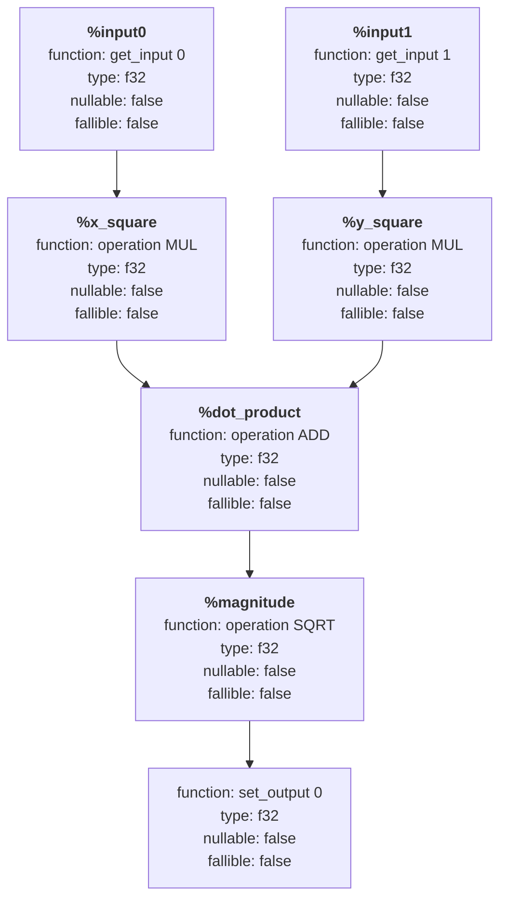

# Row IR

Row IR is libcudf's composable internal representation for data frame processing expressions to be turned into runtime-generated code. It is a static single assignment (SSA) form intermediate representation (IR) that exists because the public AST is a good way to describe an expression, but not a great way to generate code directly.

Having the program as a static single assignment IR makes lowering and code generation easily testable and inspectable.

ASTs are designed to be easy to read and reason about, yet they are not efficient for direct code generation.

If cuDF tried to go straight from its AST to CUDA source, it would have to answer a lot of important questions while simultaneously building source text, such as:

- Will this expression require null-aware execution overall?
- Will this operator still produce an always-valid output even if its inputs are nullable?
- Will this operator propagate nulls from its inputs to its output?
- Will this operator always produce a valid output even if its inputs are invalid?
- What are the error handling policies for this expression based on its inputs and operators?
- What will be the appropriate and optimal kernel configuration for this expression?

Row IR gives the code generator an ordered, concrete representation instead of forcing it to recover structure from the AST while emitting source text. In addition, an IR makes code generation predictable, testable, easy to reason about, and easy to analyze.

Row IR acts as the bridge between high-level expression semantics and the CUDA-based JIT path. The public AST (abstract syntax tree) tells you what expression the user wants, but it does not tell you the best shape of the row-level program or the expected shape of the kernel that would execute it.

Analysing ASTs while simultaneously building source text is difficult to reason about, error-prone, and leads to confusing code paths and logic inversion. It is much easier to accomplish in a structured IR.

These decisions also help us analyze an expression and reduce memory bandwidth usage and memory footprint. For example, if an operator is null-aware and produces a valid output even if its inputs are nullable, then the surrounding kernel can avoid allocating a null mask for that output. Determining this would require reasoning about both the global and local attributes of each expression.

## What Row IR Is Not

It is also helpful to be explicit about what Row IR is not:

- It is not an IR designed with a focus on aggressive code restructuring/transformations like optimising compilers. This responsibility is delegated to frontends like Velox, which perform common subexpression elimination (CSE) and other optimizations. Row IR's role is narrower and more practical: it serves as libcudf's semantic lowering layer for AST-driven JIT execution. This narrower scope is a strength, keeping the representation focused on the specific questions cuDF needs answered before runtime compilation begins.
- It is not a general-purpose GPU IR in the LLVM/NVVM/PTX sense
- It is not what nvJitLink consumes
- It is not a public-facing API for users to author JIT code. This is intentional and helps us evolve the implementation without worrying about breaking user code
- It is not a replacement for source-based JIT authoring in general

## How Row IR Works

Row IR is an intermediate program representation in the SSA form, which is a directed acyclic graph of low level row-wise operations. Each node in this graph performs exactly one operation. The nodes produce 0 or 1 values and propagate attributes from one node to the other.
These attributes allow Row IR to select optimal & correct kernel configurations.

Row IR's code generation is split into 3 progressive phases:

### Construction

The IR nodes are constructed here and could be either of:

- **GetInput**: This IR node represents a row input source, it carries information about the input such as:
    - Scalar/Non-Scalar
    - Nullability
    - Source Table
    - Column Index in Source Table
    - Type Information (e.g. scale, data types. type metadata)

- **Operation**: This IR node represents operations to be performed on another node. It contains information such as:
    - The operation code: a unique identifier of function/operator names to be executed
    - Null-awareness
    - Null-dependence
    - Null-propagation
    - Fallibility
    - Error Handling Policies (e.g.: nullify on error, propagate errors to host, discard errors)

- **SetOutput**: This IR node assigns a computed row value to its destination. This is usually the last IR node that is emitted. It is the only IR node that doesn't return a value

#### Example: Vector Magnitude Computation

A Row IR program for computing the magnitude of a vector (two columns) is conceptually:

```ll
%input0 = get_input 0
%input1 = get_input 1
%x_square = operation mul %input0, %input0
%y_square = operation mul %input1, %input1
%dot_product = operation add %x_square, %y_square
%magnitude = operation sqrt %dot_product
set_output 0 %magnitude
```

**The equivalent node construction code:**

```cpp
node getter0{input_reference{0}};
node getter1{input_reference{1}};
node x_square{opcode::MUL, {getter0, getter0}};
node y_square{opcode::MUL, {getter1, getter1}};
node dot_product{opcode::ADD, {x_square, y_square}};
node magnitude{opcode::SQRT, {dot_product}};
node setter0{output_reference{0}, magnitude};
```

NOTE: Row IR is progressively lowered and has its type & attributes resolved during instantiation.

### Instantiation & Resolution

In this phase, the following information is determined and propagated from one node to the other, e.g:

- Argument-dependent type information
- Null-awareness
- Null-propagation
- Null-dependence
- Output nullability
- Error propagation

At this stage, the IR above is conceptually lowered to:

```ll
f32 nonullable nonfallible %input0 = get_input 0 f32 nonullable
f32 nonullable nonfallible %input1 = get_input 1 f32 nonullable
f32 nonullable nonfallible %x_square = operation MUL f32 nonullable %input0, %input0
f32 nonullable nonfallible %y_square = operation MUL f32 nonullable %input1, %input1
f32 nonullable nonfallible %dot_product = operation ADD f32 nonullable %x_square, %y_square
f32 nonullable nonfallible %magnitude = operation SQRT f32 nonullable %dot_product
set_output 0 f32 nonullable %magnitude
```

**IR Node Diagram:**

The following diagram represents the Row IR graph structure for the magnitude vector example with complete attribute information:



### Code Generation

At this phase, the fully lowered IR is now converted to CUDA code. With all attributes of the IR nodes fully resolved and the kernel scope determined, the code generator can emit optimal CUDA kernels.

For a CUDA function target the equivalent code is generated:

```cpp
__device__ void transform(float* arg0, float arg1, float arg2)
{
  float input0      = arg1;
  float input1      = arg2;
  float x_square    = cudf::ops::mul(input0, input0);
  float y_square    = cudf::ops::mul(input1, input1);
  float dot_product = cudf::ops::add(x_square, y_square);
  float magnitude   = cudf::ops::sqrt(dot_product);
  *arg0             = magnitude;
}

__global__ void transform_kernel(mutable_column_device_view const* outputs,
                                 column_device_view const* inputs,
                                 int n)
{
  for (...) {
    transform(
      &outputs[0].element<float>(i), inputs[0].element<float>(i), inputs[1].element<float>(i));
  }
}
```

## Kernel Configuration & Optimization

Row IR enables the code generator to determine optimal kernel configurations by analyzing:

- Whether null handling is required throughout the entire expression
- Memory bandwidth requirements based on operation sequences
- The necessity for specialized error handling code paths
- Thread block and grid dimension requirements based on data type sizes and operation complexity

This analysis prevents over-allocation of resources and ensures predictable performance characteristics.

## Advantages of Row IR

1. **Predictability**: Code generation becomes deterministic and traceable
2. **Testability**: Each IR phase can be independently tested and validated
3. **Maintainability**: Clear separation of concerns (construction, resolution, code generation)
4. **Extensibility**: New operations and attributes can be added to the IR without disrupting existing code paths
5. **Performance**: Enables data-driven optimization decisions before CUDA code emission
