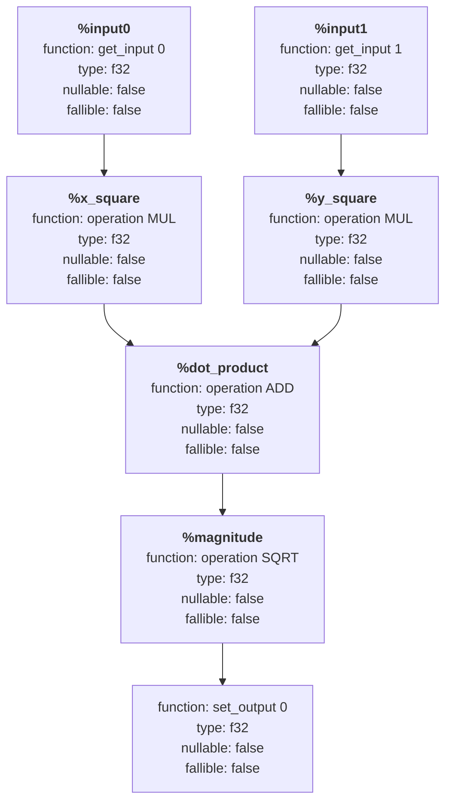

# Row IR

Row IR is libcudf's composable intermediate representation for translating data frame expressions into runtime-generated code. It uses static single-assignment (SSA) form because the public abstract syntax tree (AST) is effective for describing expressions but inefficient for direct code generation.

Representing the program in SSA form makes lowering and code generation easier to test and inspect.

Generating CUDA source directly from the cuDF AST would require answering several questions while constructing the source text:

- Will this expression require null-aware execution overall?
- Will this operator still produce an always-valid output even if its inputs are nullable?
- Will this operator propagate nulls from its inputs to its output?
- Will this operator always produce a valid output even if its inputs are invalid?
- What are the error handling policies for this expression based on its inputs and operators?
- What kernel configuration is appropriate for this expression?

Row IR gives the code generator an ordered, concrete representation instead of forcing it to recover structure from the AST while emitting source text. This representation makes code generation predictable, testable, and easier to reason about and analyze.

Row IR bridges high-level expression semantics and the CUDA-based JIT path. The public AST describes the expression a user wants, but it does not specify the best structure for the row-level program or the kernel that executes it.

Combining AST analysis with source generation produces code that is difficult to reason about, prone to errors, and susceptible to confusing control flow and logic inversion. A structured IR separates these concerns.

The information captured by Row IR can also reduce memory bandwidth and memory usage. For example, if a null-aware operator produces a valid output even when its inputs are nullable, the surrounding kernel can avoid allocating a null mask for that output. Identifying this optimization requires reasoning about both the global and local attributes of the expression.

## How Row IR Works

Row IR represents an SSA-form program as a directed acyclic graph of low-level, row-wise operations. Each node performs exactly one operation, produces zero or one value, and propagates attributes to downstream nodes. These attributes allow Row IR to select correct and efficient kernel configurations.

Row IR processes an expression in three phases. Construction builds the graph, instantiation and resolution propagate types and attributes, and code generation emits CUDA code. The following sections trace these phases in order:

### 1. Construction

The IR consists of the following node types:

- **GetInput** represents a row input source and records:
    - Whether the source is scalar
    - Nullability
    - Source table
    - Column index in the source table
    - Type information, such as the data type, scale, and other metadata

- **Operation** represents an operation applied to one or more nodes and records:
    - The operation code, which uniquely identifies the function or operator to execute
    - Null awareness
    - Null dependence
    - Null propagation
    - Fallibility
    - The error-handling policy, such as nullifying on error, propagating errors to the host, or discarding errors

- **SetOutput** assigns a computed row value to its destination. It is typically the final node emitted and the only node that does not return a value.

#### Example: Vector Magnitude Computation

A Row IR program that computes the magnitude of a vector represented by two columns looks like this:

```ll
%input0 = get_input 0
%input1 = get_input 1
%x_square = operation mul %input0, %input0
%y_square = operation mul %input1, %input1
%dot_product = operation add %x_square, %y_square
%magnitude = operation sqrt %dot_product
set_output 0 %magnitude
```

The equivalent node-construction code is:

```cpp
using namespace cudf::detail::row_ir;
node getter0{input_reference{0}};
node getter1{input_reference{1}};
node x_square{opcode::MUL, {getter0, getter0}};
node y_square{opcode::MUL, {getter1, getter1}};
node dot_product{opcode::ADD, {x_square, y_square}};
node magnitude{opcode::SQRT, {dot_product}};
node setter0{output_reference{0}, magnitude};
```

Row IR is progressively lowered, and its types and attributes are resolved during instantiation.

### 2. Instantiation and Resolution

During this phase, the following information is determined and propagated between nodes:

- Argument-dependent type information
- Null-awareness
- Null-propagation
- Null-dependence
- Output nullability
- Error propagation

At this stage, the IR above is conceptually lowered as follows:

```ll
f32 nonullable nonfallible %input0 = get_input 0 f32 nonullable
f32 nonullable nonfallible %input1 = get_input 1 f32 nonullable
f32 nonullable nonfallible %x_square = operation MUL f32 nonullable %input0, %input0
f32 nonullable nonfallible %y_square = operation MUL f32 nonullable %input1, %input1
f32 nonullable nonfallible %dot_product = operation ADD f32 nonullable %x_square, %y_square
f32 nonullable nonfallible %magnitude = operation SQRT f32 nonullable %dot_product
set_output 0 f32 nonullable %magnitude
```

#### IR Node Diagram

The following diagram shows the Row IR graph for the vector-magnitude example, including all attribute information:



### 3. Code Generation

During this phase, the fully lowered IR is converted to CUDA code. Once all node attributes are resolved and the kernel scope is determined, the code generator can emit an optimized CUDA kernel.

For a CUDA function target, the code generator emits the following equivalent code:

```cpp
__device__ int transform(float* arg0, float arg1, float arg2)
{
  float input0      = arg1;
  float input1      = arg2;
  float x_square    = cudf::detail::ops::mul(input0, input0);
  float y_square    = cudf::detail::ops::mul(input1, input1);
  float dot_product = cudf::detail::ops::add(x_square, y_square);
  float magnitude   = cudf::detail::ops::sqrt(dot_product);
  *arg0             = magnitude;
  return 0;
}

__global__ void transform_kernel(mutable_column_device_view const* outputs,
                                 column_device_view const* inputs,
                                 int n)
{
  for (...) {
    transform(
      &outputs[0].element<float>(i), inputs[0].element<float>(i), inputs[1].element<float>(i));
  }
}
```

## Kernel Configuration and Optimization

Row IR enables the code generator to determine optimal kernel configurations by analyzing:

- Whether null handling is required throughout the entire expression
- Memory bandwidth requirements based on operation sequences
- The necessity for specialized error handling code paths
- Thread block and grid dimension requirements based on data type sizes and operation complexity

This analysis prevents resource overallocation and provides predictable performance characteristics.

## Advantages of Row IR

1. **Predictability:** Makes code generation deterministic and traceable.
2. **Testability:** Allows each IR phase to be tested and validated independently.
3. **Maintainability:** Separates construction, resolution, and code generation.
4. **Extensibility:** Allows new operations and attributes to be added without disrupting existing code paths.
5. **Performance:** Enables data-driven optimization decisions before emitting CUDA code.

## Scope and Non-Goals

Row IR is intentionally narrow in scope:

- It is not designed for the aggressive code restructuring and transformations associated with optimizing compilers. Frontends such as Velox handle common subexpression elimination (CSE) and other optimizations. Row IR has a narrower role: it is libcudf's semantic lowering layer for AST-driven JIT execution. This focus keeps the representation centered on the questions cuDF must answer before runtime compilation begins.
- It is not a general-purpose GPU IR in the LLVM, NVVM, or PTX sense.
- It is not the representation consumed by nvJitLink.
- It is not a public API for authoring JIT code. This restriction allows the implementation to evolve without breaking user code.
- It is not a replacement for source-based JIT authoring.
