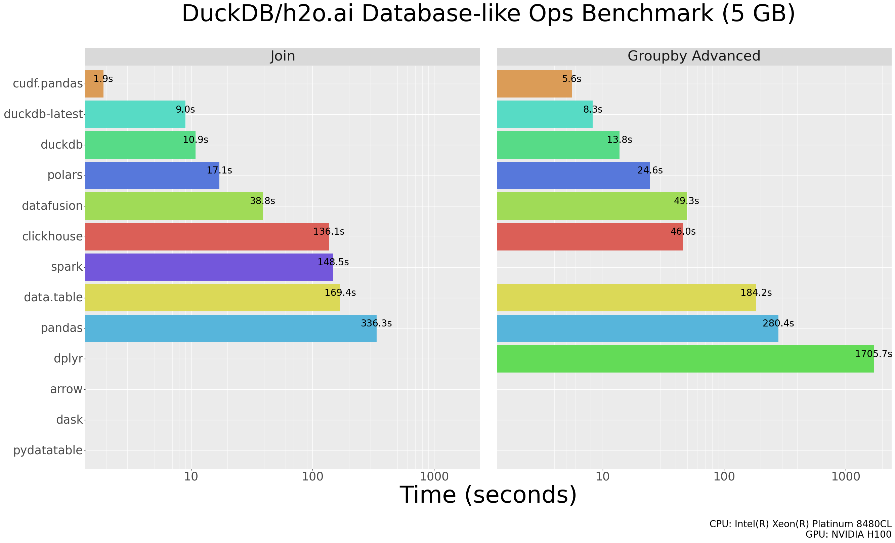

# Benchmarks

## Database-like ops benchmarks

We reproduced the [Database-like ops benchmark](https://duckdblabs.github.io/db-benchmark/)
including a solution using `cudf.pandas`. Here are the results:

<figure>



<figcaption style="text-align: center;">Results of the <a
href="https://duckdblabs.github.io/db-benchmark/">Database-like ops
benchmark</a> including <span
class="title-ref">cudf.pandas</span>.</figcaption>
</figure>

**Note:** A missing bar in the results for a particular solution
indicates we ran into an error when executing one or more queries for
that solution.

You can see the per-query results [here](https://data.rapids.ai/duckdb-benchmark/index.html).

### Steps to reproduce

Below are the steps to reproduce the `cudf.pandas` results.  The steps
to reproduce the results for other solutions are documented in
<https://github.com/duckdblabs/db-benchmark#reproduce>.

1. Clone the latest <https://github.com/duckdblabs/db-benchmark>
2. Build environments for pandas:

```bash
virtualenv pandas/py-pandas
```

3. Activate pandas virtualenv:

```bash
source pandas/py-pandas/bin/activate
```

4. Install cudf:

```bash
pip install --extra-index-url=https://pypi.nvidia.com cudf-cu12
```

5. Modify pandas join/group code to use `cudf.pandas` and remove the `dtype_backend` keyword argument (not supported):

```bash
diff --git a/pandas/groupby-pandas.py b/pandas/groupby-pandas.py
index 58eeb26..2ddb209 100755
--- a/pandas/groupby-pandas.py
+++ b/pandas/groupby-pandas.py
@@ -1,4 +1,4 @@
-#!/usr/bin/env python3
+#!/usr/bin/env -S python3 -m cudf.pandas

 print("# groupby-pandas.py", flush=True)

diff --git a/pandas/join-pandas.py b/pandas/join-pandas.py
index f39beb0..a9ad651 100755
--- a/pandas/join-pandas.py
+++ b/pandas/join-pandas.py
@@ -1,4 +1,4 @@
-#!/usr/bin/env python3
+#!/usr/bin/env -S python3 -m cudf.pandas

 print("# join-pandas.py", flush=True)

@@ -26,7 +26,7 @@ if len(src_jn_y) != 3:

 print("loading datasets " + data_name + ", " + y_data_name[0] + ", " + y_data_name[1] + ", " + y_data_name[2], flush=True)

-x = pd.read_csv(src_jn_x, engine='pyarrow', dtype_backend='pyarrow')
+x = pd.read_csv(src_jn_x, engine='pyarrow')

 # x['id1'] = x['id1'].astype('Int32')
 # x['id2'] = x['id2'].astype('Int32')
@@ -35,17 +35,17 @@ x['id4'] = x['id4'].astype('category') # remove after datatable#1691
 x['id5'] = x['id5'].astype('category')
 x['id6'] = x['id6'].astype('category')

-small = pd.read_csv(src_jn_y[0], engine='pyarrow', dtype_backend='pyarrow')
+small = pd.read_csv(src_jn_y[0], engine='pyarrow')
 # small['id1'] = small['id1'].astype('Int32')
 small['id4'] = small['id4'].astype('category')
 # small['v2'] = small['v2'].astype('float64')
-medium = pd.read_csv(src_jn_y[1], engine='pyarrow', dtype_backend='pyarrow')
+medium = pd.read_csv(src_jn_y[1], engine='pyarrow')
 # medium['id1'] = medium['id1'].astype('Int32')
 # medium['id2'] = medium['id2'].astype('Int32')
 medium['id4'] = medium['id4'].astype('category')
 medium['id5'] = medium['id5'].astype('category')
 # medium['v2'] = medium['v2'].astype('float64')
-big = pd.read_csv(src_jn_y[2], engine='pyarrow', dtype_backend='pyarrow')
+big = pd.read_csv(src_jn_y[2], engine='pyarrow')
 # big['id1'] = big['id1'].astype('Int32')
 # big['id2'] = big['id2'].astype('Int32')
 # big['id3'] = big['id3'].astype('Int32')
```

6. Run Modified pandas benchmarks:

```bash
./_launcher/solution.R --solution=pandas --task=groupby --nrow=1e7
./_launcher/solution.R --solution=pandas --task=groupby --nrow=1e8
./_launcher/solution.R --solution=pandas --task=join --nrow=1e7
./_launcher/solution.R --solution=pandas --task=join --nrow=1e8
```
