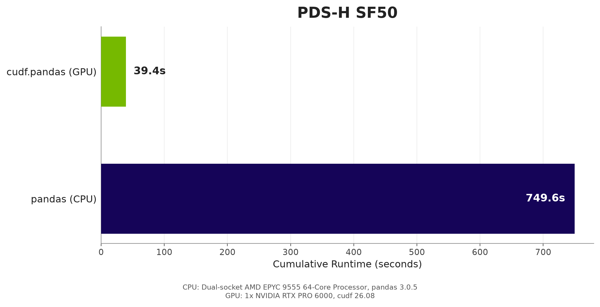

# Benchmarks

## PDS-H benchmarks

We ran the PDS-H benchmark (a TPC-H variant) to compare `cudf.pandas` on GPU
with pandas on CPU. Here are the results at scale factor 50 (roughly 50 GB of
data):

<figure>



<figcaption style="text-align: center;">PDS-H (SF50) cumulative runtime for pandas on CPU vs <span
class="title-ref">cudf.pandas</span> on GPU.</figcaption>
</figure>

The steps below reproduce these results.

### Setup

Install `cudf` following the
[RAPIDS installation guide](https://docs.rapids.ai/install/). For nightly wheels:

```bash
CUDA_MAJOR=$(nvidia-smi | grep -oP 'CUDA Version: \K[0-9]+')
pip install --extra-index-url https://pypi.anaconda.org/rapidsai-wheels-nightly/simple/ \
    "cudf-cu${CUDA_MAJOR}>=0.0.0a0"
```

Then install `tpchgen-cli`, a Rust-based TPC-H data generator used to produce the benchmark
dataset as Parquet files:

```bash
pip install tpchgen-cli
```

### Generate data

Set the scale factor once and reuse it across all steps. The following generates SF50
(scale factor 50, roughly 50GB of data):

```bash
export SCALE_FACTOR=50.0
export DATA_PATH="data/tables/scale-${SCALE_FACTOR}"

tpchgen-cli parquet -o "${DATA_PATH}" -s ${SCALE_FACTOR}
```

### Run

**CPU** (`--frontend pandas-cpu`, pandas):

```bash
python -m cudf.pandas._benchmarks.pdsh all \
    --frontend pandas-cpu \
    --path "${DATA_PATH}"
```

**GPU** (`--frontend in-memory`, cudf.pandas):

```bash
python -m cudf.pandas._benchmarks.pdsh all \
    --frontend in-memory \
    --path "${DATA_PATH}"
```

### Results

Results are written to `pdsh_results.jsonl` in the current directory by default (override with `-o`).
Each run appends one JSON line containing metadata and a `records` field with per-query,
per-iteration timings:

```json
{
  "engine_name": "cudf-pandas",
  "query_set": "pdsh",
  "frontend": "in-memory",
  "dataset_path": "data/tables/scale-50.0",
  "scale_factor": 50,
  "records": {
    "1": [
      {"query": 1, "iteration": 0, "duration": 0.79, "status": "success"},
      {"query": 1, "iteration": 1, "duration": 0.55, "status": "success"}
    ]
  }
}
```

`duration` is in seconds. Running multiple frontends with the same `-o` file appends each as a
separate line, making it easy to compare CPU and GPU results in one file.
