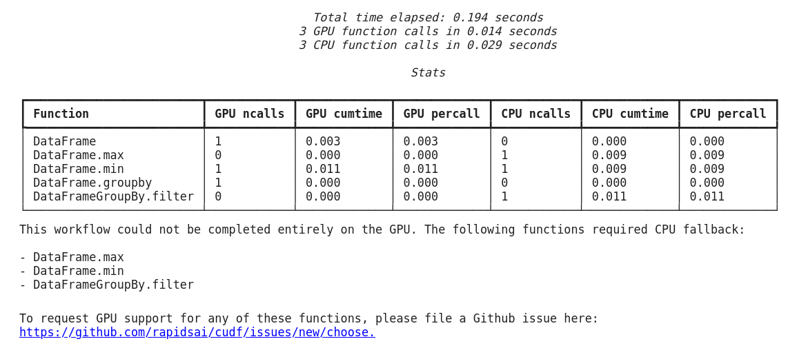

# How it works

When using cuDF's pandas Accelerator Mode, operations execute on the GPU where
possible and on the CPU otherwise, synchronizing under the hood as needed.

All `cudf.pandas` objects are a proxy to either a GPU (cuDF) or CPU (pandas)
object at any given time. Attribute lookups and method calls are first
attempted on the GPU object. If that fails, they're attempted on the CPU
object. Additionally, `cudf.pandas` special cases chained method calls (for
example `groupby-apply`) that can fail at any level of the chain and rewinds
and replays the chain minimally to deliver a correct result. Data is
automatically transferred from host to device (and vice versa) only when
necessary, avoiding unnecessary device-host transfers.

When using cudf.pandas, cuDF’s [pandas compatibility
mode](https://docs.rapids.ai/api/cudf/stable/api_docs/options/#available-options)
is automatically enabled, ensuring consistency with pandas-specific
semantics like default sort ordering.

## How We Ensure Consistency with Pandas

Every change to cuDF pandas Accelerator Mode is tested against the entire
pandas unit test suite. Currently, we're passing **93%** of the 187,000+ unit
tests, with a goal of passing 100%.

We also run nightly continuous integration (CI) tests to track interactions
between cudf.pandas and other third party libraries. These tests currently
cover most canonical use cases between pandas and the corresponding libraries.

To learn more about consistency with pandas and third-party library
compatibility, please visit the [FAQ](./faq.md).

## Understanding Performance

Because some operations in a workflow may run on the CPU, cuDF provides unique
profiling tools to help understand performance specifically designed for pandas
Accelerator Mode.

The function profiler gives visibility into which operations used the GPU or
CPU, how many times each operation was executed, how much time each operation
took, and the total time elapsed. It also provides a quick link to file a
GitHub issue to start a discussion about potential additional GPU-accelerated
functionality in cuDF if the output of your profile indicates that some tasks
were performed on the CPU.

When using cudf.pandas in a Jupyter Notebook, the function profiler can be used
with the `%%cudf.pandas.profile` magic:


```python
%load_ext cudf.pandas
import pandas as pd
```

```python
%%cudf.pandas.profile
df = pd.DataFrame({'a': [0, 1, 2], 'b': [3,4,3]})

df.min(axis=1)
out = df.groupby('a').filter(
    lambda group: len(group) > 1
)
```



When using cudf.pandas at the command line to profile a Python script, the
function profiler can be used with `python -m cudf.pandas --profile script.py`.

