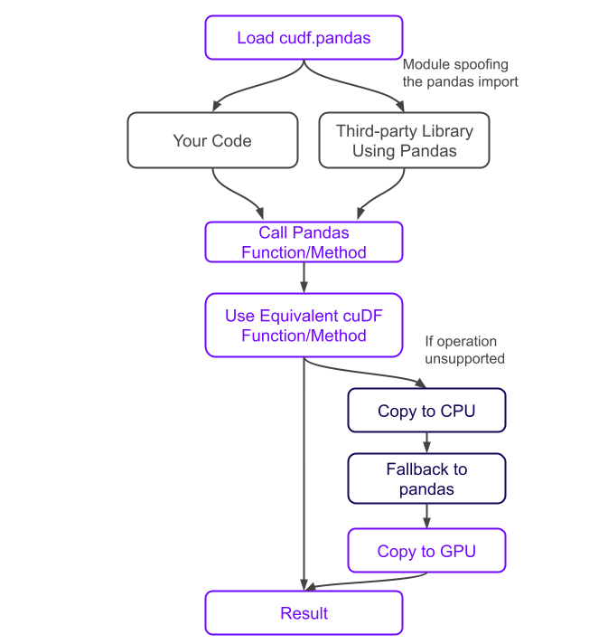

# How it Works

When `cudf.pandas` is activated, `import pandas` (or any of its
submodules) imports a proxy module, rather than "regular" pandas. This
proxy module contains proxy types and proxy functions:

```python
In [1]: %load_ext cudf.pandas

In [2]: import pandas as pd

In [3]: pd
Out[3]: <module 'pandas' (ModuleAccelerator(fast=cudf, slow=pandas))>
```

Operations on proxy types/functions execute on the GPU where
possible and on the CPU otherwise, synchronizing under the hood as
needed. This applies to pandas operations both in your code and
in third-party libraries you may be using.



All `cudf.pandas` objects are a proxy to either a GPU (cuDF) or CPU
(pandas) object at any given time. Attribute lookups and method calls
are first attempted on the GPU (copying from CPU if necessary).  If
that fails, the operation is attempted on the CPU (copying from GPU if
necessary).

Additionally, `cudf.pandas` special cases chained method calls (for
example `.groupby().rolling().apply()`) that can fail at any level of
the chain and rewinds and replays the chain minimally to deliver the
correct result. Data is automatically transferred from host to device
(and vice versa) only when necessary, avoiding unnecessary device-host
transfers.

When using `cudf.pandas`, cuDF's [pandas compatibility
mode](api.options) is automatically enabled, ensuring consistency with
pandas-specific semantics like default sort ordering.


`cudf.pandas` uses a managed memory pool by default. This allows `cudf.pandas` to process datasets larger than the memory of the GPU(s) it is running on. Managed memory prefetching is also enabled by default to improve memory access performance. For more information on CUDA Unified Memory (managed memory), performance and prefetching, see [this NVIDIA Developer blog post](https://developer.nvidia.com/blog/improving-gpu-memory-oversubscription-performance/).

Pool allocators improve allocation performance. Without using one, memory
allocation may be a bottleneck depending on the workload. Managed memory
enables oversubscribing GPU memory. This allows cudf.pandas to process
data larger than GPU memory in many cases, without CPU (Pandas) fallback.

Other memory allocators can be used by changing the environment
variable `CUDF_PANDAS_RMM_MODE` to one of the following.

1. "managed_pool" (default): CUDA Unified Memory (managed memory) with RMM's asynchronous pool allocator.
2. "managed": CUDA Unified Memory, (managed memory) with no pool allocator.
3. "async": CUDA's built-in pool asynchronous pool allocator with normal CUDA device memory.
4. "pool": RMM's asynchronous pool allocator with normal CUDA device memory.
5. "cuda": normal CUDA device memory with no pool allocator.
