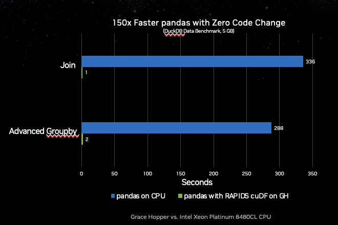

# cudf.pandas

<h2 style="color: #9234eb;">OPEN BETA: ACCELERATING PANDAS WITH ZERO CODE CHANGE</h2>

**CTA: Try it now on Colab**

<h3>cuDF Pandas Accelerator Mode</h3>
A unified CPU/GPU experience that brings best-in-class performance to your
Pandas workflows,  Designed for Pandas users who want to keep using Pandas as
data sizes grow into the GBs and performance degrades.


<br/>
<style type="text/css">
.td {padding: 0 15px;}
.tg  {border-collapse:collapse;border-spacing:0;}
.tg td{border-color:black;border-style:solid;border-width:1px;font-family:Arial, sans-serif;font-size:14px;
  overflow:hidden;padding:10px 5px;word-break:normal;color:#CED6DD;}
.tg th{border-color:black;border-style:solid;border-width:1px;font-family:Arial, sans-serif;font-size:14px;
  font-weight:normal;overflow:hidden;padding:10px 5px;word-break:normal;color:#CED6DD;}
.tg .tg-0pky{border-color:inherit;text-align:left;vertical-align:top}
.tg .tg-0lax{text-align:left;vertical-align:top}
</style>
<table class="tg">
<thead>
  <tr>
    <th class="tg-0pky"><span style="font-weight:700;font-style:normal;text-decoration:none">Zero Code Change Acceleration</span><br><span style="font-weight:400;font-style:normal;text-decoration:none">Just load the cuDF IPython/Jupyter Notebook extension or use the cuDF Python module option.</span></th>
    <th class="tg-0lax"><span style="font-weight:700;font-style:normal;text-decoration:none">Third-Party Library Compatible</span><br><span style="font-weight:400;font-style:normal;text-decoration:none">Pandas accelerator mode is compatible with most third-party libraries that operate on Pandas objects.</span></th>
  </tr>
</thead>
<tbody>
  <tr>
    <td class="tg-0lax"><span style="font-weight:700;font-style:normal;text-decoration:none">One Codepath</span><br><span style="font-weight:400;font-style:normal;text-decoration:none">Develop, test, and run in production with a single codebase, regardless of hardware.</span></td>
    <td class="tg-0lax"><span style="font-weight:700;font-style:normal;text-decoration:none">Designed for When Pandas is Too Slow</span><br><span style="font-weight:400;font-style:normal;text-decoration:none">Keep using pandas rather than learning new frameworks or paradigms as your data grows. Just accelerate it on a GPU.</span></td>
  </tr>
</tbody>
</table>

<h3>Bringing the Speed of cuDF to Every Pandas User</h3>

``cudf.pandas`` can be used with Jupyter Notebooks or any Python script:


<table class="tg">
<thead>
  <tr>
    <th class="tg-0pky">Python Script</th>
    <th class="tg-0pky">Notebook</th>
  </tr>
</thead>
<tbody>
  <tr>
    <td class="tg-0pky">

```python
import pandas as pd
df = pd.read_csv("filepath")
df.groupby(“col”).mean()
df.rolling(window=3).sum()

# python -m cudf.pandas script.py
```


</td>
    <td class="tg-0pky">

```python
%load_ext cudf.pandas

import pandas as pd
df = pd.read_csv("filepath")
df.groupby(“col”).mean()
df.rolling(window=3).sum()
```

</td>
  </tr>
</tbody>
</table>

<br/>


With cuDF’s Pandas Accelerator Mode, you can take Pandas from worst-to-first on
the DuckDB dataset benchmarks without changing any code (0.5 GB and 5 GB
scales).




Learn more about these benchmark results and how to reproduce them in the
[announcement blog].

## Getting Started


Try It Now on Colab
Take cuDF’s new Pandas Accelerator Mode for a test-drive in a free GPU-enabled
notebook environment using your Google account.

Visit the [RAPIDS Quick Start](https://rapids.ai/#quick-start) to get up-and-running on every other platform.


```{toctree}
:maxdepth: 1

how-it-works
faq
```
