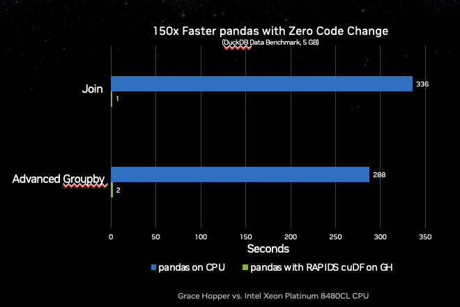

cuDF Pandas Accelerator Mode
-----------------------------

Open Beta: Accelerating pandas with zero coda change
~~~~~~~~~~~~~~~~~~~~~~~~~~~~~~~~~~~~~~~~~~~~~~~~~~~~

.. image:: ../_static/colab.png
    :width: 200px

`Try it now on Colab <http://nvda.ws/rapids-cudf>`_

A unified CPU/GPU experience that brings best-in-class performance to your
pandas workflows, ``cudf.pandas`` is designed for people who want to keep using
pandas as data sizes grow into the GBs and performance slows.

+---------------------------------------------------------------------------------------------+---------------------------------------------------------------------------------------------------------------------+
| **Zero Code Change Acceleration**                                                           | **Third-Party Library Compatible**                                                                                  |
|                                                                                             |                                                                                                                     |
| Just load the cuDF IPython/Jupyter Notebook extension or use the cuDF Python module option. | pandas accelerator mode is compatible with most third-party libraries that operate on pandas objects.               |
+---------------------------------------------------------------------------------------------+---------------------------------------------------------------------------------------------------------------------+
| **One Codepath**                                                                            | **Designed for When Pandas is Too Slow**                                                                            |
|                                                                                             |                                                                                                                     |
| Develop, test, and run in production with a single codebase, regardless of hardware.        | Keep using pandas rather than learning new frameworks or paradigms as your data grows. Just accelerate it on a GPU. |
+---------------------------------------------------------------------------------------------+---------------------------------------------------------------------------------------------------------------------+

Bringing the Speed of cuDF to Every pandas User
~~~~~~~~~~~~~~~~~~~~~~~~~~~~~~~~~~~~~~~~~~~~~~~

``cudf.pandas`` can be used with Jupyter Notebooks or any Python script:

.. list-table::
   :widths: 1 1
   :header-rows: 1

   *  -  Python Script
      -  Notebook

   *  -  .. code-block:: python

            import pandas as pd
            df = pd.read_csv("filepath")
            df.groupby(“col”).mean()
            df.rolling(window=3).sum()

            # python -m cudf.pandas script.py

      -  .. code-block:: python

            %load_ext cudf.pandas

            import pandas as pd
            df = pd.read_csv("filepath")
            df.groupby(“col”).mean()
            df.rolling(window=3).sum()

With cuDF’s pandas Accelerator Mode, you can take pandas from worst-to-first on
the DuckDB dataset benchmarks without changing any code (0.5 GB and 5 GB
scales).

Learn more about these benchmark results and how to reproduce them in the
:ref:`benchmarks`.

Getting Started
---------------

.. image:: ../_static/colab.png
    :width: 200px

`Try it now on Colab <http://nvda.ws/rapids-cudf>`_
Take cuDF’s new pandas Accelerator Mode for a test-drive in a free `GPU-enabled
notebook <http://nvda.ws/rapids-cudf>`_ environment using your Google account.

Visit the `RAPIDS Quick Start <https://rapids.ai/#quick-start>`_ to get
up-and-running on every other platform.

.. toctree::
   :maxdepth: 1
   :caption: Contents:

   how-it-works
   faq
   benchmarks
