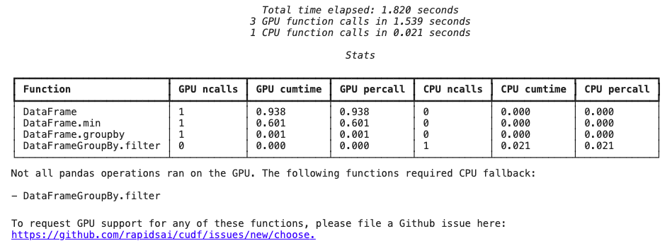

# Usage

## Jupyter Notebooks and IPython

Load the `cudf.pandas` extension at the beginning of your
notebook. After that, just `import pandas` and operations will use the
GPU:

```python
%load_ext cudf.pandas

import pandas as pd

URL = "https://github.com/plotly/datasets/raw/master/tips.csv"
df = pd.read_csv(URL)                 # uses the GPU
df["size"].value_counts()             # uses the GPU
df.groupby("size").total_bill.mean()  # uses the GPU
df.apply(list, axis=1)                # uses the CPU (fallback)
```

## Command-line usage

From the command line, run your Python scripts with `-m cudf.pandas`:

```bash
python -m cudf.pandas script.py
```

### Usage in tandem with
[`multiprocessing`](https://docs.python.org/3/library/multiprocessing.html)
or
[`concurrent.futures`](https://docs.python.org/3/library/concurrent.futures.html)
process pools

To use a pool of workers (for example
[`multiprocessing.Pool`](https://docs.python.org/3/library/multiprocessing.html#multiprocessing.pool.Pool)
or
[`concurrent.futures.ProcessPoolExecutor`](https://docs.python.org/3/library/concurrent.futures.html#concurrent.futures.ProcessPoolExecutor))
in your script with `cudf.pandas`, the `cudf.pandas` module must be
loaded on the worker processes, as well as by the controlling script.
The most foolproof way to do this is to programmatically install
`cudf.pandas` at the top of your script, before anything else.
For example

```python
# This is equivalent to python -m cudf.pandas, but will run on the
# workers too. These two lines must run before pandas is imported,
# either directly or transitively.
import cudf.pandas
cudf.pandas.install()

from multiprocessing import Pool

with Pool(4) as pool:
    # use pool here
    ...
```

## Understanding performance - the `cudf.pandas` profiler

`cudf.pandas` will attempt to use the GPU whenever possible and fall
back to CPU for certain operations. Running your code with the
`cudf.pandas.profile` magic generates a report showing which
operations used the GPU and which used the CPU. This can help you
identify parts of your code that could be rewritten to be more
GPU-friendly.

### Using the Function Profiler

First, enable `cudf.pandas`:

```python
%load_ext cudf.pandas
import pandas as pd
```

Next, use the IPython/Jupyter magic `cudf.pandas.profile`:

```python
%%cudf.pandas.profile
df = pd.DataFrame({'a': [0, 1, 2], 'b': [3, 4, 3]})

df.min(axis=1)
out = df.groupby('a').filter(
    lambda group: len(group) > 1
)
```

This gives a profiler output after the cell runs, shown below.



When an operation falls back to using the CPU, it's typically because
that operation isn't implemented by cuDF. The profiler generates a
handy link to report the missing functionality to the cuDF team.

### Using the Line Profiler

There is a line profiler activated by the IPython/Jupyter magic `cudf.pandas.line_profile`:

```python
%%cudf.pandas.line_profile
df = pd.DataFrame({'a': [0, 1, 2], 'b': [3, 4, 3]})

df.min(axis=1)
out = df.groupby('a').filter(
    lambda group: len(group) > 1
)
```

The output of the line profiler shows the source code and how much time each line spent executing on the GPU and CPU.


### Profiling from the command line

To profile a script being run from the command line, pass the
`--profile` argument:

```bash
python -m cudf.pandas --profile script.py
```
