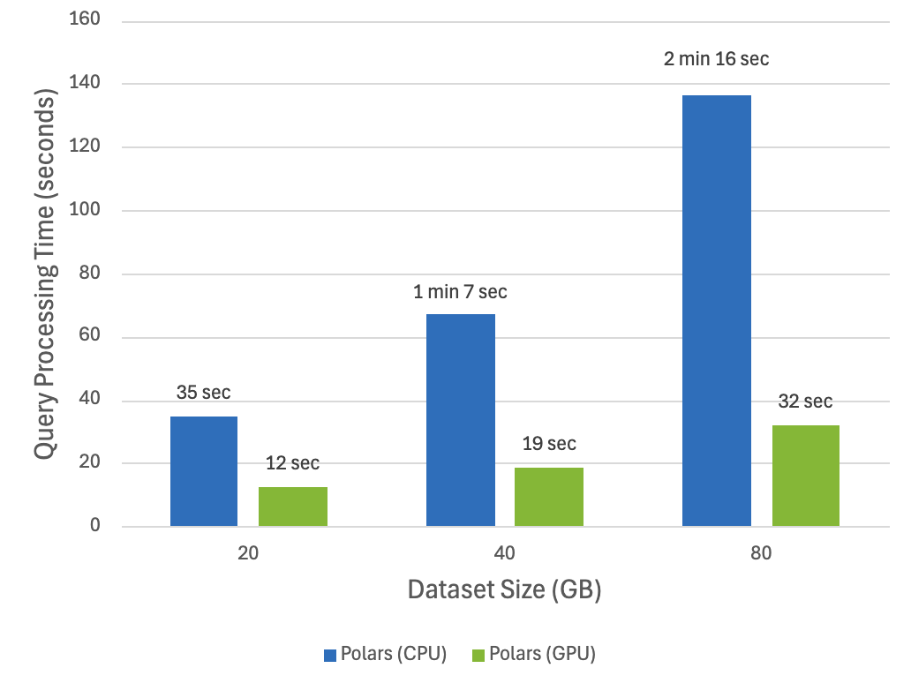
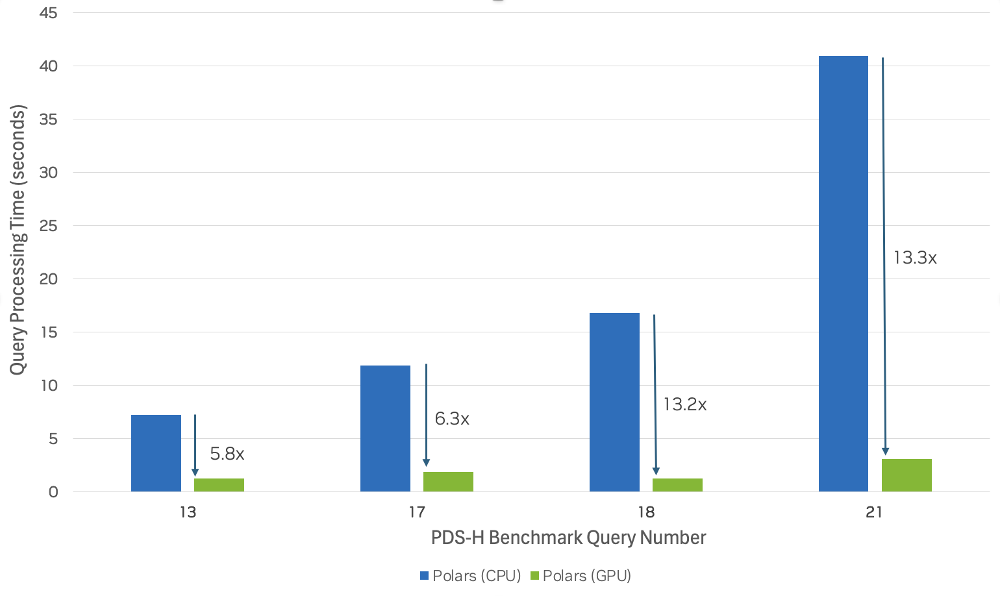

Polars GPU engine
=================

cuDF provides an in-memory, GPU-accelerated execution engine for Python users of the Polars Lazy API.
The engine supports most of the core expressions and data types as well as a growing set of more advanced dataframe manipulations
and data file formats. When using the GPU engine, Polars will convert expressions into an optimized query plan and determine
whether the plan is supported on the GPU. If it is not, the execution will transparently fall back to the standard Polars engine
and run on the CPU.

Benchmark
---------
We reproduced the `Polars Decision Support (PDS) <https://github.com/pola-rs/polars-benchmark>`__ benchmark to compare Polars GPU engine with the default CPU settings across several dataset sizes. Here are the results:

You can see up to 13x speedup using the GPU engine on the compute-heavy PDS queries involving complex aggregation and join operations. Below are the speedups for the top performing queries:

:emphasis:`PDS-H benchmark | GPU: NVIDIA H100 PCIe | CPU: Intel Xeon W9-3495X (Sapphire Rapids) | Storage: Local NVMe`

You can reproduce the results by visiting the `Polars Decision Support (PDS) GitHub repository <https://github.com/pola-rs/polars-benchmark>`__.

Learn More
----------

The GPU engine for Polars is now available in Open Beta and the engine is undergoing rapid development. To learn more, visit the `GPU Support page <https://docs.pola.rs/user-guide/gpu-support/>`__ on the Polars website.

Launch on Google Colab
----------------------

   Try out the GPU engine for Polars in a free GPU notebook environment. Sign in with your Google account and `launch the demo on Colab <https://colab.research.google.com/github/rapidsai-community/showcase/blob/main/accelerated_data_processing_examples/polars_gpu_engine_demo.ipynb>`__.

.. toctree::
   :maxdepth: 1
   :caption: Engine Config Options:

   engine_options
