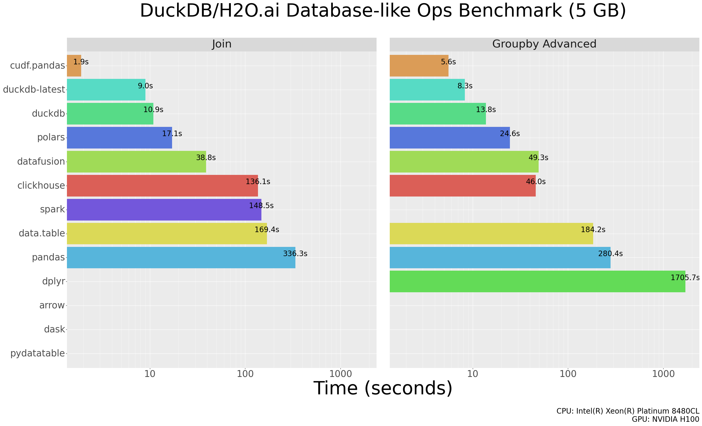

Welcome to the cuDF documentation!
==================================

.. figure:: _static/RAPIDS-logo-purple.png
    :width: 300px
    :align: center

**cuDF** (pronounced "KOO-dee-eff") is a Python GPU DataFrame library (built
on the `Apache Arrow <https://arrow.apache.org/>`_ columnar memory format)
for loading, joining, aggregating, filtering, and otherwise manipulating data.
cuDF also provides a pandas-like API that will be familiar to data engineers
& data scientists, so they can use it to easily accelerate their workflows
without going into the details of CUDA programming.

``cudf.pandas`` is built on cuDF and accelerates pandas code on the
GPU.  It supports 100% of the pandas API, using the GPU for
supported operations, and automatically falling back to pandas for
other operations.

    Results of the `Database-like ops benchmark <https://duckdblabs.github.io/db-benchmark/>`_ including `cudf.pandas`. See details `here <cudf_pandas/benchmarks.html>`_.

.. toctree::
   :maxdepth: 1
   :caption: Contents:

   user_guide/index
   cudf_pandas/index
   cudf_polars/index
   pylibcudf/index
   libcudf_docs/index
   developer_guide/index
