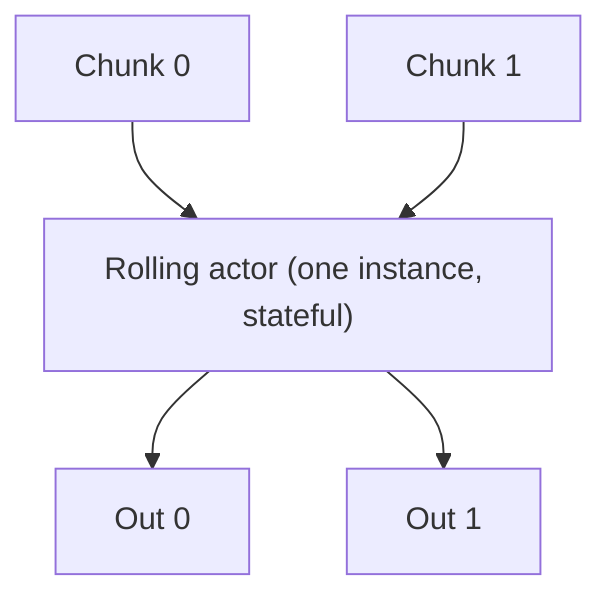
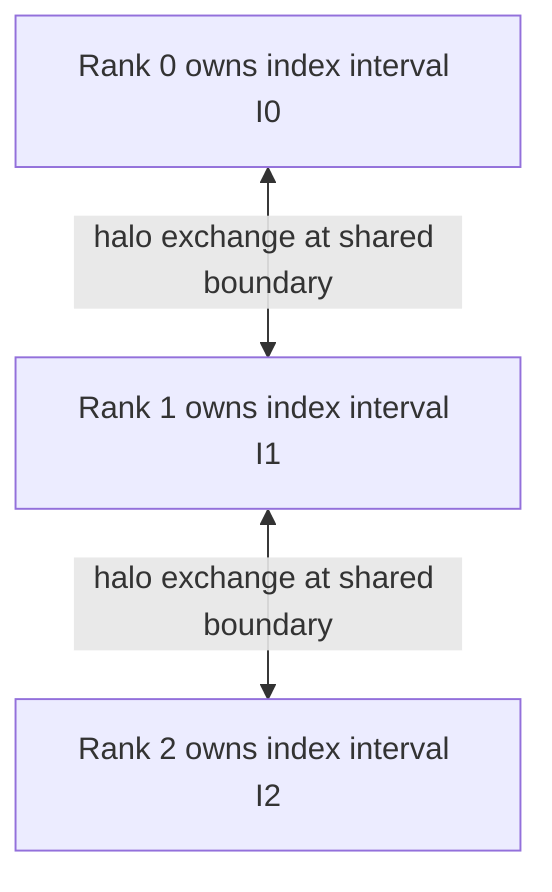

# Design: Rolling and window operations in cudf-polars (rapidsmpf runtime)

## Document status

**Draft.** Intended audience: cudf-polars and **RapidsMPF** library developers.

**Terminology**

- **RapidsMPF** — the standalone streaming/distributed library (channels, actors, communicators, shuffle/sort primitives such as **sort_actor**).
- **rapidsmpf runtime** — the cudf-polars streaming executor that **uses** RapidsMPF (`executor.runtime == "rapidsmpf"`), including lowering, `generate_ir_sub_network`, and dynamic planning under `cudf_polars/experimental/rapidsmpf/`.

Unless stated otherwise, "runtime" in this doc means the **rapidsmpf runtime**, not the RapidsMPF Python package name in isolation.

This doc focuses on the **rapidsmpf runtime**; the legacy **tasks** runtime is out of scope. **Deprecation of the tasks runtime** is project direction (the **rapidsmpf runtime** is the supported streaming path going forward); link the authoritative issue or release-note entry here when it exists: *TBD*.

---

## 1. Executive summary

cudf-polars today implements **range rolling** and **partitioned window expressions** (`.over(...)`) correctly on a **single GPU table** via the DSL and libcudf. The **experimental / streaming** layer does not implement distributed or chunked-aware window execution: unsupported cases **fall back** (often collapsing to a single partition / `Repartition`), which is correct but not scalable.

This document proposes an architecture for **scalable window support in the rapidsmpf runtime** (implemented with **RapidsMPF** streaming primitives) for:

1. **Range rolling** (`LazyFrame.rolling(...).agg(...)`, `Rolling` IR, and related expression forms).
2. **Group-scoped window mapping** (`.over(...)` / `GroupedRollingWindow`), including ordered variants (`order_by`, ranks, cumulative scans where applicable).
3. **Ordered aggregation inside `group_by`:** `group_by(...).agg(..., sort_by=...)` (and equivalent plans), which drives **per-group sort** semantics and often appears in the same IR family as window-like logic (`GroupedRollingWindow`). This is **not** the same API surface as `.over()` or `LazyFrame.rolling`, but it **blocks the same FSI queries** (e.g. **open/close**, **first/last** trade or quote by time within an instrument).

**Primary execution context:** **dynamic planning** (default for the **rapidsmpf runtime**), unknown chunk sizes at compile time, and **ChannelMetadata**-driven optimizations once available (e.g. skip sort when streams are already ordered).

**Correctness bar:** Results must match **CPU Polars** and **DuckDB** for validated queries—not best-effort approximations.

**Chunking / partition sizing (defaults, not aspirational):** IO partition sizing is driven by **`StreamingExecutor.target_partition_size`** (bytes). Defaults are computed from **device memory** (see `default_target_partition_size` in `cudf_polars/utils/config.py`): **between 1 GiB and 10 GiB** per partition, with a **~2.5%** of device memory rule for many cluster/runtime combinations—so **~1–2 GiB is a common band on typical GPUs**, not a hardcoded constant. Row caps also use **`max_rows_per_partition`** (default **1_000_000**). **Operational tuning** often raises byte targets to saturate the GPU. **Boundary rows** relative to window width are often a **small fraction** of a partition when windows are narrow; implementation must still handle **wide** windows correctly.

**Phasing philosophy:** Do **not** rely on a **production** "gather the whole table then roll" path. **Durable** primitives (shuffle placement in the **rapidsmpf runtime** plan, **RapidsMPF** sort/metadata/boundary messaging) are the intended solution. A **debug-only** all-gather (or single-rank concat) **behind an explicit flag** remains acceptable **temporarily** for golden-test harnesses while rolling actors are under development—see §9 and §11.

---

## 2. Semantics note (Polars vs cudf-polars IR)

**FSI and TPC-DS** are the main workload drivers; exact query priority is produced by **Phase A** (§9).

Polars overloads "window." The non-obvious mapping for this codebase:

- **`LazyFrame.rolling(...).agg(...)`** → **`Rolling` IR** + libcudf **range** rolling over an index column (see `rewrite_rolling`). This is **not** the same mechanism as **`.over(...)`**.
- **`.over(partition_by=..., order_by=...)`** → **`GroupedRollingWindow`**: **one** aggregate (or rank / scan) **per partition key**, then **broadcast**—**grouped window mapping**, not range rolling over `order_by` unless Polars and the DSL evolve.

### 2.1 Range rolling (sketch)

`LazyFrame.rolling(index_column=..., period=..., offset=..., closed=..., group_by=...).agg(...)`: window bounds come from the **index** and `closed`. **Grouped** rolling restricts to a key; index must be **sorted** per group. cudf-polars today: **non-null** index; some **month**-based durations may be rejected in translation (`duration_to_int`).

### 2.2 `.over(...)`: unordered vs ordered (fast path)

- **No `order_by`:** One value per group (e.g. `sum().over(ric)`). After **hash shuffle** so a group is **complete on one rank**, eval is **local agg + broadcast**—**no per-group sort**. Prefer this milestone before ordered `.over`.
- **With `order_by`:** Needs **stable per-group sort** (or metadata proving order) before `GroupedRollingWindow`. Shares infra with **`group_by` + `sort_by`** (§2.3).

### 2.3 `group_by.agg(..., sort_by=...)` (in scope)

Distinct from `.over` and `Rolling` IR, but often **per-group sort** + agg (e.g. first/last by time within a key). Multi-partition correctness requires **shuffle + sort-within-group** (or metadata). Record concrete Polars spellings and IR nodes in the Phase A inventory; extend the §3 table when translation is pinned down.

---

## 3. Polars → cudf-polars translation

| Polars / user concept                                                | cudf-polars representation                                                          | libcudf / evaluation notes                                                                                 |
| -------------------------------------------------------------------- | ----------------------------------------------------------------------------------- | ---------------------------------------------------------------------------------------------------------- |
| `LazyFrame.rolling(...).agg(...)`                                    | `rewrite_rolling` builds **`Sort`** on group keys (if any) + **`Rolling` IR**       | `plc.rolling.grouped_range_rolling_window` on a single table                                               |
| Expression `.rolling(...)` on aggregations (older / alternate paths) | `RollingWindow` expression                                                          | Same underlying rolling primitive                                                                          |
| `.over(partition_by, order_by=...)`                                  | `GroupedRollingWindow`                                                              | Grouped window **mapping** (not range windows unless Polars adds `rolling().over()` and we extend the DSL) |
| `group_by(...).agg(..., sort_by=...)` / per-group ordered agg        | **TBD** — concrete IR mapping to be pinned in **Phase A** inventory (typically involves **`Sort`** / per-group order + agg paths) | Per-group **sort** then agg; align with streaming **shuffle**                                              |

**Implication:** Streaming work splits into **(A)** chunked / distributed **`Rolling` IR**, **(B)** **`GroupedRollingWindow`** (unordered path first, then ordered), and **(C)** **`group_by` + `sort_by`**.

---

## 4. Current behavior (streaming / experimental, rapidsmpf runtime)

- **`Rolling` IR:** No dedicated `@lower_ir_node.register(Rolling)`; the generic **`IR`** handler applies **`_lower_ir_fallback`**, which (for the **rapidsmpf runtime**) wraps children in **`Repartition`** and forces **partition count 1** for the subtree.
- **`Select` with non-pointwise expressions:** `GroupedRollingWindow` is **not** handled by `decompose_expr_graph` for multi-partition graphs; decomposition raises **`NotImplementedError`**, which triggers the same **fallback** path.
- **Filters:** If the predicate may depend on **`.over(...)`** (`GroupedRollingWindow` in the mask) and the child has **multiple partitions**, lowering collapses with an explicit user message.
- **HStack / other non-pointwise paths:** Similar fallback patterns; experimental tests (e.g. rolling in `with_columns`) may warn that multi-partition **HStack** is unsupported.

**Net:** The **rapidsmpf runtime** can **execute** many plans only because **fallback** produces a **single logical chunk** (via `Repartition` / RapidsMPF collectives) before calling existing **`do_evaluate`**. That is **correct** but limits throughput and memory.

---

## 5. Goals and non-goals

### 5.1 Goals

- **Correctness** vs CPU Polars and DuckDB for supported query shapes.
- **rapidsmpf runtime first:** Design for **dynamic planning**, streaming chunks, and future **ChannelMetadata** (e.g. "incoming already sorted on columns X").
- **Integration with streaming Sort:** Assume **`sort_actor`** (or equivalent) can appear in the network; optionally **elide** sort work when metadata proves ordering.
- **Scalable direction:** Prefer **shuffle + per-partition work + boundary exchange** over **full global gather** when we implement the durable solution (exact phasing TBD).
- **Operational:** **Silent fallback** remains acceptable initially; maintainers can use **`fallback_mode: raise`** to detect reliance on fallback. **Document** which patterns still hit **`Repartition`** collapse until native lowering lands.

### 5.2 Non-goals (initial draft; refine as scope tightens)

- Parity with **every** Polars window edge case on day one (enumerate exceptions in implementation milestones).
- **Legacy tasks** runtime behavior (deprecated).
- **Best-effort** or approximate window results.

---

## 6. Prerequisites (RapidsMPF library vs rapidsmpf runtime)

### 6.1 RapidsMPF library (and chunk metadata contract)

Capabilities the **RapidsMPF** library (and agreed **cudf-polars ↔ RapidsMPF** metadata conventions) should expose so the **rapidsmpf runtime** can implement windows efficiently:

- **Declarative ordering metadata** on chunks (**ChannelMetadata**): sorted columns, null order, stability—so a **sort_actor** (RapidsMPF actor) can no-op when safe.
  - **Status:** Treat **full sort-elision metadata** as **in-flight / verify in tree** unless a specific PR has landed. The **contract** spans **RapidsMPF** channel types and **rapidsmpf runtime** producers/consumers.
  - **Phase dependency:** **§9 Phase F** is **blocked** until **ChannelMetadata** (or equivalent) is **end-to-end** for operators that care about ordering (sort, rolling, ordered `.over`).
- **Boundary messaging** for **range rolling:** exchange of **boundary rows** or rolling state between ranks with **adjacent index intervals** after global order or range partition (per group if grouped). **Single-rank** streaming may use **suffix/prefix** state between chunks **inside an actor in the rapidsmpf runtime network** without cross-rank messaging.

#### Multi-rank patterns and P2P

| Multi-rank track                                  | Dependence on a **P2P-style** API |
| ------------------------------------------------- | --------------------------------- |
| **Unordered** `.over` (Phase **C**)               | **Low** — **hash shuffle** is the core primitive. |
| **Ordered** `.over` / **`sort_by`** (Phase **D**) | **Low** — canonical plan is shuffle-then-local-sort (see below). |
| **Range rolling** across ranks (Phase **E**)      | **High** — correctness needs **O(window)** halo visibility at partition seams; directed low-fanout messaging is the natural fit. |

**Why Phase D does not need rank-to-rank P2P (canonical plan):** For `.over(partition_by, order_by=...)` and `group_by.agg(..., sort_by=...)`, the window / ordered agg is defined **inside each partition key**. Recipe: **(1) hash shuffle** so all rows of a key land on one rank, **(2) sort locally** by `order_by` / within-group key, **(3) evaluate locally**. No cross-rank boundary inside a group. Seams between consecutive chunks on the same rank are handled with **in-actor carry-over state** (same as single-rank Phase B).

**P2P status (resolved):** RapidsMPF already has the underlying P2P primitives. The outstanding work is a **Python wrapper** to make these messages **awaitable** (async API). This is sufficient to begin Phase E prototypes; Phases C and D should proceed on shuffle + local eval in parallel.

**Halo exchange design for Phase E:** Because the rolling actor must buffer all local chunks in a **spillable messages container** before producing output (output ordering constraint — see §7.5), both the **upper and lower halo regions are exchanged simultaneously**. There is no sequencing benefit to doing one direction before the other, and the buffering cost is already paid.

### 6.2 rapidsmpf runtime (cudf-polars)

- **Dynamic planning:** Lowering and fanout must tolerate **unknown partition counts** and **variable chunk sizes**. Window operators may use **runtime-adaptive** buffer caps while staying **correct** (block/spill until boundary data is available).
- **Deterministic partition assignment** for **group keys** (hash **Shuffle** IR, RapidsMPF shuffle subnets) so `.over` / grouped rolling **alignment** matches single-table semantics.

---

## 7. Execution strategies

*(No matrix: same content as one subsection per track to avoid duplicating table cells and prose.)*

### 7.1 Range rolling (`Rolling` IR)

**Single-rank:** After **sort order** per group (or globally), a **rolling actor** consumes **ordered chunks** with **carry-over state** across chunk boundaries. Sort via **sort_actor** or **metadata skip**. See **§7.5** for a diagram.

**Multi-rank:** Establish order (**range partition** on index, or **shuffle by group** + sort within group). The rolling actor **buffers all local chunks** in a spillable messages container (it cannot push output out of order), then exchanges **both upper and lower halos simultaneously** with adjacent ranks — the buffering cost is already paid so there is no reason to sequence the two directions. Then applies rolling locally with cross-rank boundary data merged in. **No production all-gather** (§9.3). See §7.5.

### 7.2 `.over` / `GroupedRollingWindow`

**Single-rank:** Chunks may **split groups**—**shuffle** on `partition_by` for **group completeness**. **Unordered:** local eval + broadcast. **Ordered:** add **per-group sort** (or metadata).

**Multi-rank:** **Unordered:** hash shuffle → local eval (**easier** than range rolling; phasing §9). **Ordered:** shuffle + **sort within group** + local **`GroupedRollingWindow`** / DSL paths.

### 7.3 `group_by` + `sort_by` / ordered agg

Same pattern as **ordered `.over`**: shuffle by group key if needed, **sort within group**, then agg—**per rank** after shuffle in the multi-rank case.

### 7.4 Default implementation order (vs multi-rank `.over`)

**Single-rank range rolling** is **local** (carry-over at chunk edges only). **Multi-rank `.over`** needs a **correct distributed shuffle** and often **sort-within-group**—collectives, dynamic planning, skew.

Default order in §9: **Phase A** → **single-rank range rolling** → **multi-rank unordered `.over`** → **ordered `.over` / `sort_by`** → **multi-rank range rolling**. Deviations need explicit **risk / product** justification.

### 7.5 Illustration: single-rank carry-over vs multi-rank halos

A cartoon view of a **simple** ungrouped range rolling plan (sorted index; each row needs prior rows within window **W**). **Grouped** rolling is the same idea **per group**—each group's rows form their own ordered stream (carry-over or halos apply **within** that stream).

**Single-rank (one GPU, many chunks)** — **one** **rolling_actor** instance consumes **already-sorted** chunks **sequentially**. It keeps a **small internal buffer** (suffix of the previous chunk, sized by **W** in rows or in index units—not the whole dataset). The diagram uses a **single** node for that actor (not two separate actors):

Interpretation: after **Chunk 0**, the actor retains a **trailing suffix** inside its state; when **Chunk 1** arrives, it **logically prepends** that suffix so windows **straddling** the chunk boundary match libcudf / Polars on the **concatenated** table. The same actor repeats for **Chunk 2**, …

**Multi-rank** — after **range partition** on the index, each rank holds a **contiguous index interval**. The rolling actor must buffer all local chunks in a **spillable messages container** before producing any output (it cannot push results out of order). Since all local data is already buffered, **both upper and lower halos are exchanged simultaneously** with adjacent ranks — there is no sequencing benefit to doing one direction first, and the buffering cost is already paid regardless.

Interpretation: **Rank 1** exchanges halos with both **Rank 0** and **Rank 2** simultaneously. The halo size is **O(window width)**, not full-table. This directed seam is what **Phase E** ties to the P2P Python wrapper work described in §6.1.

Plain-language contrast:

| Question | Single-rank | Multi-rank (range rolling) |
|----------|-------------|----------------------------|
| **Who "talks"?** | Same **actor instance**, **later in time** | **Different ranks**, same pipeline stage |
| **What crosses the boundary?** | **In-process** buffer (chunk *k*−1 → chunk *k*) | **Bidirectional halo messages** with adjacent ranks (both directions exchanged simultaneously) |
| **Typical size** | **≈ window footprint** at seam | **≈ window footprint** at each rank seam |
| **Why buffer everything?** | Carry-over state is small | Output ordering constraint forces full local buffering; simultaneous halo exchange is the natural consequence |

If a Mermaid renderer is unavailable: **single-rank = one stateful actor + tail buffer between chunks; multi-rank = full local buffer in spillable messages + simultaneous bidirectional halo exchange with neighbors.**

---

## 8. IR, lowering, and network generation

### 8.1 Lowering (`lower_ir_graph` / `lower_ir_node`)

- Register **dedicated** handlers for **`Rolling`** (instead of generic fallback).
- Teach **`Select` / `decompose_expr_graph`** to decompose **`GroupedRollingWindow`** into **Shuffle + Sort + local eval**, or add an explicit **`Window`** IR node if that clarifies fanout and metadata.

### 8.2 rapidsmpf runtime network generation (`generate_ir_sub_network`)

Implemented under `cudf_polars/experimental/rapidsmpf/`; registers **RapidsMPF** subnets via **`generate_ir_sub_network`** (and related helpers):

- Emit **rolling_actor** (and **shuffle** / **sort** subnets) with correct **fanin/fanout** under **dynamic planning**.
- Thread **ChannelMetadata** from producers into **sort_actor** and **rolling_actor** when available.

---

## 9. Phased rollout and milestones (TBD; draft skeleton)

### 9.1 Gating rule

**No phase B–F is "done" without Phase A.** Later phases must name **concrete queries or test IDs** from the **Phase A inventory** (TPC-DS query ids—note TPC-DS stresses **SQL window functions** more than `LazyFrame.rolling`—FSI notebooks, etc.). Generic "correctness vs Polars" is necessary but **not sufficient**—each phase closes with **checklist rows** in the inventory.

The inventory also records **TPC-DS vs FSI ordering** in the backlog; this doc does not fix a single global priority between them—only that **both** must be **reachable** without silent wrong answers.

### 9.2 Default phase order

| Phase | Scope                                                                                                                                                                                                                  | Success criteria                                                                                    |
| ----- | ---------------------------------------------------------------------------------------------------------------------------------------------------------------------------------------------------------------------- | --------------------------------------------------------------------------------------------------- |
| **A** | **Inventory + prioritization:** Map **TPC-DS** and **FSI** templates to **IR nodes** (`Rolling`, `GroupedRollingWindow`, `group_by`+`sort_by`, `join_asof`, …). Deliver **ordered backlog** and **golden query list**. | Signed-off table or test manifest: *query id → IR features → Polars snippet → DuckDB SQL (if used)* |
| **B** | **Single-rank range rolling:** **rolling actor** with **carry-over / boundary** state; integrates with **sort_actor** when present.                                                                                    | All **Phase A rows tagged `Rolling` + single-rank** pass golden tests; chunk-split stress tests     |
| **C** | **Multi-rank unordered `.over`:** hash shuffle + **no `order_by`** local `GroupedRollingWindow` / equivalent.                                                                                                          | All **Phase A rows tagged `.over` unordered** pass on **≥2 ranks**                                  |
| **D** | **Ordered window path:** `.over(..., order_by=...)` **and** **`group_by` + `sort_by`** on streaming partitions, single- and multi-rank.                                                                                | All **Phase A rows tagged `order_by` / `sort_by`** pass golden tests                                |
| **E** | **Multi-rank range rolling:** distributed order + **boundary exchange**, **no production all-gather**                                                                                                                  | All **Phase A rows tagged `Rolling` + multi-rank** pass; performance vs baseline documented         |
| **F** | **Metadata optimizations:** ChannelMetadata-driven **sort elision** and safe shuffle shortcuts                                                                                                                         | **Depends on §6.1 ChannelMetadata E2E**; performance wins, zero golden regressions                  |

### 9.3 All-gather stance (resolved)

- **Production:** **No** milestone that **depends** on **full-table all-gather** for general rolling / `.over`.
- **Development:** Optional **debug / CI hook** (env var or flag) **forcing concat / gather** for golden comparison while **B/E** are in progress—must **not** be the only shipped path.

---

## 10. Testing and validation

- **Golden:** Same LazyFrame on **cudf-polars (rapidsmpf runtime)** vs **CPU Polars** vs **DuckDB** where SQL is **semantically aligned** with the Polars query (document per case; **RANGE**/**ROWS** and frame rules differ across engines—do not assume identical SQL implies identical semantics).
- **Corpus hygiene:** Record **minimum Polars / IR version** for the golden set; bump when upstream expression shapes change (`rolling`, `over`, `sort_by`).
- **Chunk stress:** Split ordered input into **many small** vs **few large** chunks for boundary logic.
- **Multi-rank:** Fixed seeds; **partition skew**.
- **Dynamic planning:** Unknown row counts; no incorrect **sort elision** when metadata is absent or wrong.
- **Fallback audit:** **`fallback_mode: raise`** in CI or nightly.

---

## 11. Open questions and decisions

1. **Workload priority within Phase A:** Order **TPC-DS** vs **FSI** rows in the signed-off inventory (implementation order **B→F** is fixed by difficulty).
2. **FSI workflow explicitly:** v1 expressible with **`Rolling` + joins** only, or **as-of** / other ops—possibly separate design doc.
3. **Window IR node:** Explicit **`Window` / `RollingExec` IR** vs composing **Sort + Shuffle + Map** only.
4. ~~**RapidsMPF library transport:** P2P vs collective-only~~ **Resolved:** RapidsMPF already has the P2P primitives; the work is a Python **awaitable wrapper**. Both upper and lower halos are exchanged simultaneously (see §6.1 and §7.5).
5. **Debug gather flag:** **Name**, **scope** (CI vs dev), **removal criteria** when **B** and **E** are green on the Phase A list.

---

## 12. References (in-tree)

- `cudf_polars/dsl/ir.py` — `Rolling` IR, `do_evaluate`
- `cudf_polars/dsl/utils/rolling.py` — `rewrite_rolling`
- `cudf_polars/dsl/expressions/rolling.py` — `RollingWindow`, `GroupedRollingWindow`
- `cudf_polars/experimental/utils.py` — `_lower_ir_fallback`, `_contains_over`
- `cudf_polars/experimental/select.py`, `expressions.py` — decomposition, fallback
- `cudf_polars/experimental/rapidsmpf/repartition.py` — concatenate / repartition actors
- `docs/hstack-cse-and-select-lowering.md` — related lowering patterns

---

*Authors: maintainers (RapidsMPF library + cudf-polars / rapidsmpf runtime). Update as implementation lands.*
